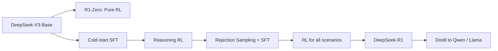

# DeepSeek-R1: Incentivizing Reasoning Capability in LLMs via Reinforcement Learning

## TL;DR

- DeepSeek-R1 真正想证明的不是“我们做了一个更会想的模型”，而是 `大规模 RL 本身就能催生 reasoning pattern`，甚至在 `R1-Zero` 阶段完全不依赖 cold-start SFT 也能长出自反思与延长思考时间的行为。
- 它在生态里的位置很清楚: 这是开源 reasoning model 路线的标志性报告，核心贡献主要在训练流程而不是底座架构。
- 最值得先读的部分是 `Section 2.2 R1-Zero`、`Section 2.3 R1 pipeline`、`Table 2`、`Table 5`。

## 3-Minute Summary

- DeepSeek-R1 这篇报告展示了三件事:
  - `R1-Zero`: 仅靠 RL，从 base model 里激发 reasoning 行为
  - `R1`: 用少量 cold-start CoT 数据 + RL + rejection sampling + 第二轮 RL，把模型变得既强又可读
  - `Distill`: 把 R1 的 reasoning trace 蒸馏到较小的 Qwen / Llama 模型上
- 这篇报告最有价值的地方不是最终分数，而是它把 reasoning model 训练拆成了明确的四阶段流水线。
- 如果你想研究“reasoning 到底是 SFT 教出来的，还是 RL 激出来的”，R1 是绕不过去的材料。

## 这篇报告解决什么问题

- 传统提升 reasoning 的方式往往严重依赖高质量长 CoT 人工或半人工数据。
- DeepSeek-R1 试图回答两个更激进的问题:
  - 如果不给 SFT cold start，纯 RL 能不能把 reasoning 行为激发出来？
  - 如果纯 RL 会长出能力，但输出很乱、不适合用户读，能不能再把它变成可用 assistant？
- 这正是 R1-Zero 和 R1 的分工:
  - `R1-Zero` 负责回答“能力能否自然涌现”
  - `R1` 负责回答“怎样把这种能力产品化”

## 核心技术拆解

### Model Architecture

> Paper pointers: Abstract, Section 2, official repo.

- R1 不是一篇新架构论文。
- 主模型本体继承 `DeepSeek-V3-Base`，因此其底座架构仍然是:
  - `671B` total parameters
  - `37B` activated parameters
  - `128K` context
  - `MLA + MoE` 的 DeepSeek-V3 路线
- 这意味着 R1 的真正创新不在主干 block，而在训练 pipeline。
- 这点非常重要，因为很多读者会误以为 reasoning model 的关键是“改结构”。R1 恰恰反过来说明: 在足够强的 base model 上，训练过程本身可以是主贡献。

### Data Engineering

> Paper pointers: Section 2.3.1-2.3.4.

- R1 数据工程的重点不是海量 pretraining data，而是 reasoning post-training data 的构造与筛选。
- `Cold Start` 阶段:
  - 只构造并收集“少量高质量长 CoT 数据”
  - 规模上不是百万级，而是 `thousands of cold-start data`
  - 来源包括 few-shot prompting、直接 prompting 生成 detailed answers、把 R1-Zero 输出转成可读格式、再由人工后处理
- `Reasoning RL` 阶段:
  - 关注 coding、math、science、logic 等可验证任务
  - 这类任务的优点是 reward 能更稳定地规则化
- `Rejection Sampling + SFT` 阶段:
  - reasoning data 约 `600k`
  - non-reasoning data 约 `200k`
  - 合计约 `800k` 样本
  - 非 reasoning 数据直接复用 DeepSeek-V3 pipeline 的一部分
- 数据过滤规则非常像真实工程，而不是只看正确率:
  - 过滤 mixed-language CoT
  - 过滤太长的大段落
  - 过滤 code blocks
  - 只保留多次采样中正确的 reasoning trace
- 这说明 R1 的数据工程不是“多生成一点 CoT 就行”，而是高度关注 `readability + correctness + distribution balance`。

### Training Infrastructure

- 这篇 R1 报告没有像 DeepSeek-V3 报告那样展开训练框架细节。
- 因为它的基础设施 largely 继承 DeepSeek-V3。
- 真正需要你关注的是“训练阶段组织”，而不是额外的并行系统创新:
  - Stage 1: cold-start SFT
  - Stage 2: reasoning-oriented RL
  - Stage 3: rejection sampling + SFT
  - Stage 4: RL for all scenarios
- 所以 R1 的 infrastructure lesson 更接近“pipeline design”，而不是“kernel design”。

### Key Insights and Hidden Tricks

- 最反直觉的点之一: `R1-Zero` 直接在 base model 上做 RL，居然能自然出现 reflection 和 rethinking 行为。
- 第二个非常关键的点: 纯 RL 可以长出 reasoning，但也会长出糟糕的可读性，包括 language mixing 和输出格式混乱。
- 第三个点: 语言一致性奖励 (`language consistency reward`) 会让性能略降，但更符合人类偏好和可读性。
- 第四个点: 对 general helpfulness，只评估 final summary；对 harmlessness，则评估完整 response。这是一个非常有产品味道的 reward 设计。

## 训练与数据

> Paper pointers: Section 2.2-2.4.

- `R1-Zero`:
  - 不做 cold-start SFT
  - 直接在 base model 上做 RL
  - 用模板强制输出 `<think>` 和 `<answer>` 结构
- `R1` 四阶段:
  - `Cold Start`: 用几千条长 CoT 数据把 actor 初始化到更可读区域
  - `Reasoning-oriented RL`: 针对 coding / math / science / logic 做大规模 RL
  - `Rejection Sampling + SFT`: 用收敛后的 reasoning checkpoint 收集 600k reasoning + 200k non-reasoning 样本，再做 2 epochs SFT
  - `RL for all scenarios`: 同时优化 reasoning、helpfulness 和 harmlessness
- 这一流程的关键不在“每一步都新”，而在“它把纯 reasoning RL 的好处保留下来，同时逐步把模型拉回产品可用区间”。

## 后训练 / 对齐

### SFT

- `Cold Start` 阶段的 SFT 目标不是广覆盖，而是把 reasoning trace 变得更清晰、可读。
- 论文给出的格式设计很有代表性:
  - 输出被组织成 `|special_token|<reasoning_process>|special_token|
`
- 在 rejection sampling 之后，再做一次更大规模 SFT:
  - reasoning 样本约 `600k`
  - non-reasoning 样本约 `200k`
  - 总计约 `800k`
  - 对 `DeepSeek-V3-Base` 训练 `2 epochs`

### Preference Optimization / RL

- R1 的 RL 核心仍然是 `GRPO`。
- `R1-Zero` 的 reward 主要是规则型:
  - accuracy reward: 数学答案格式可验证、代码可编译可测试
  - format reward: 约束输出满足 `<think>/<answer>` 模板
- `R1` 阶段进一步引入:
  - `language consistency reward`
  - general helpfulness / harmlessness 的 reward model
- 一个很有意思的设计是 reward 的作用对象:
  - helpfulness 只看 final summary，尽量不干扰中间 reasoning chain
  - harmlessness 看 entire response，包括 reasoning process 和 summary
- 这是 reasoning model 对齐里非常值得学的一点: 你不一定要把所有 reward 都直接打到 CoT 上。

## 评测与对比

- `R1-Zero` 的 verified reasoning 指标已经非常强:
  - `AIME 2024 pass@1 71.0`
  - `AIME cons@64 86.7`
  - `MATH-500 95.9`
  - `GPQA Diamond 73.3`
  - `LiveCodeBench 50.0`
  - `CodeForces rating 1444`
- 论文进一步写到:
  - `DeepSeek-R1` 在 reasoning tasks 上可与 `OpenAI-o1-1217` 相比
- distilled models 也很说明问题:
  - `DeepSeek-R1-Distill-Qwen-7B`: `AIME 55.5`, `MATH-500 92.8`
  - `DeepSeek-R1-Distill-Qwen-32B`: `AIME 72.6`, `MATH-500 94.3`
  - `DeepSeek-R1-Distill-Llama-70B`: `AIME 70.0`, `MATH-500 94.5`, `GPQA 65.2`
- 这些结果说明两件事:
  - reasoning 能力可以靠 RL 在大模型中强烈激发
  - 这种能力也可以通过高质量 trace 蒸馏到更小的 dense model

## 相关代码 / 复现

- 官方仓库: [deepseek-ai/DeepSeek-R1](https://github.com/deepseek-ai/DeepSeek-R1)
- 官方 Hugging Face: [deepseek-ai/DeepSeek-R1](https://huggingface.co/deepseek-ai/DeepSeek-R1)
- 开源复现: [huggingface/open-r1](https://github.com/huggingface/open-r1)
- 说明:
  - 官方没有完整公开全部训练数据和所有 reward 细节
  - `open-r1` 更像可研究、可复现实验框架，而不是“官方配方逐字复制”

## 真正值得学的点

- 值得抄作业的部分:
  - 先用 pure RL 探索 reasoning 上限，再用 cold-start data 修正可读性
  - 用规则 reward 解决可验证任务
  - 把 helpfulness 和 harmlessness 分别绑定到不同输出粒度
  - 高质量 reasoning trace 的 distillation 非常强
- 只适合大厂 / 大集群的部分:
  - 大规模 RL 反复迭代
  - 复杂 reward 管线和多场景 prompt 分布设计
- 对个人学习者最有价值的部分:
  - 理解 reasoning model 不是“多写思维链”这么简单
  - 理解可读性、语言一致性、长度控制都是真实问题

## 局限与疑问

- 论文没有公开完整的 RL 超参设置和采样预算。
- full R1 的 many-shot / pass@k 评估设定与采样数选择，读者最好结合复现项目再核查。
- 语言一致性奖励会轻微损害性能，这说明“更像人类可读推理”不一定总和“更强 reasoning”一致。
- Distill 模型只做了 SFT，没有继续 RL，因此仍然不能把它们等同于 full R1 的上限能力。

## 延伸阅读

- 前置材料: [DeepSeek-V3](deepseek_v3.md)
- 同路线报告: [Llama 3](../llama/llama3.md)
- 应该一起读的方法论文:
  - [GRPO](../../papers/alignment/grpo.md)
  - [DPO](../../papers/alignment/dpo.md)

## Review Checklist

- [x] 关键事实已核查
- [x] 公开信息和个人推断已分开
- [x] 关键图表和结论已对应到原文位置
- [x] 已补充官方仓库 / 权重 / 复现链接
