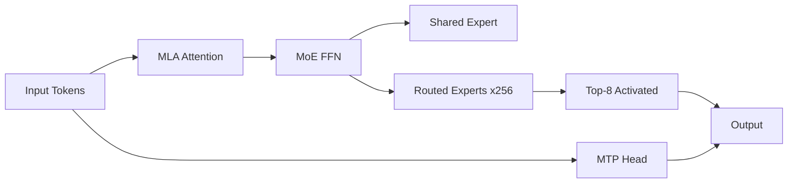
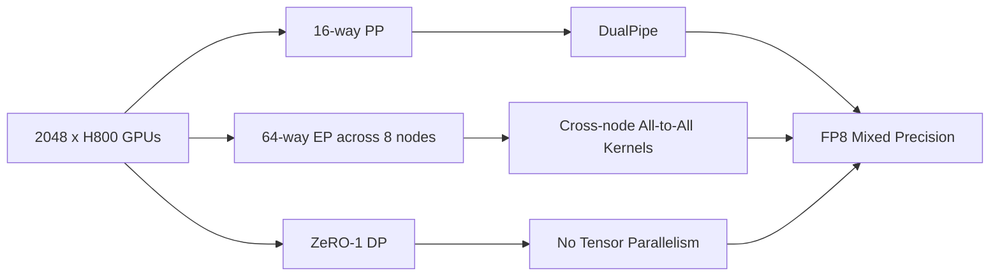

# DeepSeek-V3 Technical Report

## TL;DR

- DeepSeek-V3 最关键的不是“又一个大 MoE”，而是它把 `MLA + MoE + FP8 + 通信/内存协同优化 + reasoning distillation` 做成了一套完整系统。
- 它在开源生态里的位置很特殊: 如果 Llama 3 更像“极致成熟的 dense recipe”，那 DeepSeek-V3 更像“架构、系统、硬件协同优化的开源代表作”。
- 最值得先读的部分是 `Section 2 Architecture`、`Section 3 Infrastructures`、`Section 4.1/4.5`、`Section 5.2/5.4`。

## 3-Minute Summary

- DeepSeek-V3 公开了一条非常完整的大模型路线: 高效注意力 (`MLA`)、大规模稀疏专家 (`DeepSeekMoE`)、`auxiliary-loss-free load balancing`、`multi-token prediction`、`FP8` 训练、`DualPipe` 管线并行，以及从 `R1` 蒸馏 reasoning 的 post-training。
- 这篇报告最有价值的地方在于它没有把“性能提升”归因到单一 trick，而是明确展示: 超大模型的能力来自算法、数据、训练框架、集群拓扑和后训练共同作用。
- 如果你在学开源 LLM 的系统工程，这篇报告的价值甚至不亚于它的 benchmark，因为它真实回答了一个难问题: `671B` 这种规模的模型，怎么在公开条件下把训练和推理成本控制住。

## 这篇报告解决什么问题

- DeepSeek-V3 要解决的核心矛盾非常直接:
  - 怎样让开源模型在数学、代码、开放对话等多个方向逼近一线闭源模型
  - 同时不把训练和推理成本做成不可承受的天价
- 这篇报告真正厉害的地方是它承认“模型规模继续上涨之后，问题已经不只是模型结构”。
- 在 `671B total / 37B activated` 这种级别上，决定成败的因素包括:
  - 注意力如何控制 KV cache
  - MoE 如何避免路由失衡和通信爆炸
  - FP8 如何不把训练稳定性打崩
  - 后训练如何把 reasoning 模型的优点蒸馏回标准聊天模型
- 所以 DeepSeek-V3 更像一篇 `co-design report`，而不只是 model card。

## 核心技术拆解

### Model Architecture

> Paper pointers: Section 2, Figure 2, Figure 3, Table 2.

- 基础配置:
  - `61` 层
  - hidden size `7168`
  - `128` 个 attention heads
  - per-head dim `128`
  - query compression dim `1536`
  - KV compression dim `512`
- 这不是标准 dense Transformer。DeepSeek-V3 的两个主干创新来自 DeepSeek-V2，并在 V3 被真正做大做稳:
  - `MLA (Multi-head Latent Attention)`
  - `DeepSeekMoE`
- `MLA` 的本质不是“换一种 attention 写法”这么简单，而是直接针对 `KV cache` 成本下手。
  - 它对 `Q`、`K`、`V` 做低秩压缩
  - 推理时不再缓存完整 K/V，而是缓存压缩后的 latent 表示和与 RoPE 相关的解耦部分
  - 这意味着同样的上下文长度下，推理显存压力显著下降
- DeepSeek-V3 的论文没有在这一篇里给出一个简单的“MLA 节省了 X% 显存”的通用数字，因此不要把社区二手总结当成论文原话。
- `MoE` 结构公开得很细:
  - 除前 `3` 层外，其余 FFN 都换成 `MoE`
  - 每个 MoE 层 `1` 个 shared expert + `256` 个 routed experts
  - 每个 token 激活 `8` 个 routed experts
  - 每个 token 最多被路由到 `4` 个节点
  - 每个 expert 的 intermediate dim 为 `2048`
- 这个设计的重要性在于，它不是单纯把 expert 数堆高，而是从一开始就按跨节点通信来约束路由。
- `auxiliary-loss-free load balancing` 是 V3 的核心创新之一:
  - 传统 MoE 常用 auxiliary loss 逼路由均衡
  - DeepSeek-V3 改为给 expert 引入 routing bias，只在选 top-k 路由时起作用
  - gating value 仍来自原始 affinity score
  - 这样做的目的是把“保持性能”和“保持均衡”更干净地拆开
- 论文的消融结论很强:
  - 相比 purely aux-loss-based 的平衡方式，`auxiliary-loss-free` 在多数 benchmark 上更好
  - 作者进一步指出，真正值钱的是 `batch-wise` balance，而不是对每个 sequence 进行硬平衡
- `MTP (Multi-Token Prediction)` 是另一个非常关键的模块:
  - V3 采用 `depth=1` 的 MTP，即除下一个 token 外，还额外预测一个未来 token
  - 这在训练时增加了信号密度，也让推理阶段可以用于 speculative decoding

### Data Engineering

> Paper pointers: Section 4.1.

- DeepSeek-V3 的数据工程虽然没公开精确配比，但公开了方向性变化，而且这些变化足够有学习价值。
- 论文明确写到，相比 DeepSeek-V2，他们做了四类变化:
  - 提高数学和编程样本比例
  - 扩展英文和中文之外的 multilingual 覆盖
  - 精简冗余、保留语料多样性
  - 使用 `document packing`
- 公开数据量:
  - `14.8T` 高质量 tokens
- 公开的数据处理细节:
  - 使用 `document packing`
  - 不使用 cross-sample attention masking
  - 引入 `FIM`，具体采用 `Prefix-Suffix-Middle (PSM)`
  - FIM 比例为 `0.1`
  - tokenizer 是 byte-level BPE，词表 `128K`
  - tokenizer pretokenizer 为 multilingual compression 做了优化
- 这篇报告没有公开 Web / Code / Math / Multilingual 的精确比例，因此这里必须老老实实写“未披露”。
- 但已经足够得出一个高价值判断:
  - DeepSeek-V3 的性能不是只靠架构
  - 它明显把数据侧的“代码/数学偏置”和“多语言扩展”当成主因之一

### Training Infrastructure

> Paper pointers: Section 3, Table 1, Figure 4.

- 这是 DeepSeek-V3 最值钱的部分之一。
- 集群规模:
  - `2048` 张 `NVIDIA H800`
  - 每节点 `8` 卡，节点内 `NVLink/NVSwitch`，节点间 `InfiniBand`
- 并行策略:
  - `16-way Pipeline Parallelism`
  - `64-way Expert Parallelism`，跨 `8` 个节点
  - `ZeRO-1 Data Parallelism`
  - 明确不使用 Tensor Parallelism，以降低成本和复杂度
- `DualPipe` 的核心意义:
  - 减少 pipeline bubbles
  - 更重要的是把前向/反向计算与 MoE 通信重叠起来
- 跨节点 all-to-all 的实现也很硬核:
  - 利用 `IB` 和 `NVLink` 的不同带宽特性做分层转发
  - 限制每个 token 最多发到 `4` 个节点，降低 `IB` 流量
  - 作者给出的结论是仅用 `20 SMs` 即可充分利用 `IB` 和 `NVLink` 带宽
- `FP8` 是另一个重点:
  - 报告强调这是第一次在这种极大规模模型上验证 `FP8 mixed precision training` 的可行性和有效性
- 显存优化方面，两个点很值得记:
  - 反向传播时重算 `RMSNorm` 和 `MLA up-projection`
  - 把参数 `EMA` 异步存到 CPU，减少 GPU 负担
- 训练成本是公开得非常罕见的一项:
  - pretraining `2664K H800 GPU hours`
  - context extension `119K`
  - post-training `5K`
  - total `2788K`
  - 论文按 `$2 / GPU hour` 估算总成本约 `$5.576M`
- 稳定性结论非常强:
  - 报告明确写到整个训练过程没有发生 `irrecoverable loss spikes`
  - 也没有做任何 rollback

### Key Insights and Hidden Tricks

- 最反直觉的点之一: `auxiliary-loss-free` 不是“更少约束所以更差”，而是因为它把路由平衡从“损失函数惩罚”改成“routing bias 调节”，反而减轻了性能损伤。
- 第二个值钱结论: `batch-wise balance` 比 `sequence-wise balance` 更好，因为它给 expert specialization 留了更大空间。
- 第三个点: `MTP` 不只是训练损失的小修小补。报告直接给出额外 token 的 acceptance rate 在 `85%-90%`，并带来约 `1.8x TPS` 的推理增益潜力。
- 第四个点: DeepSeek-V3 不掉 token。报告直接写了 `no token-dropping`，这意味着它的负载均衡和推理部署不是靠牺牲 token 完整性换吞吐。

## 训练与数据

- 预训练阶段:
  - 最大序列长度 `4K`
  - 预训练 token `14.8T`
  - 训练后两阶段扩展上下文到 `32K -> 128K`
- tokenizer:
  - byte-level BPE
  - vocabulary `128K`
- FIM:
  - 采用 `PSM`
  - 比例 `0.1`
- 论文还公开了训练 schedule 的结构:
  - 前 `2K` steps warmup
  - 先长时间 constant LR，再 cosine decay
  - 最后 `500B` tokens 再做两段 constant LR
  - batch size 从 `3072` 逐渐增加到 `15360`
- 需要注意:
  - ar5iv 页面里一部分数学公式和超参数符号渲染缺失，所以如果后续要做“超参表抄写版”，最好回原 PDF 再补一次。

## 后训练 / 对齐

### SFT

> Paper pointers: Section 5.1, 5.4.1.

- SFT 数据规模为 `1.5M` 实例，覆盖多域。
- reasoning 数据不是直接把 `R1` 的输出一股脑拿来蒸馏，报告明确提到他们遇到三个问题:
  - overthinking
  - 输出格式差
  - 输出过长
- 他们的做法是:
  - 用内部 reasoning 模型提供高质量推理模式
  - 针对不同领域训练 expert model
  - 再通过 `SFT + RL` 生成更适合最终模型的数据
  - 最后 rejection sampling 保留“推理强，但更可读、更紧凑”的样本

### Preference Optimization / RL

- DeepSeek-V3 的 RL 使用 `GRPO`。
- reward 设计分成两类:
  - `rule-based reward`: 适合数学、代码等可验证任务
  - `model-based reward`: 适合开放问答、创意写作等不易硬验证任务
- 一个非常重要的细节是 reward data 构造:
  - 为了减轻 reward hacking，论文写到他们构造的 preference data 不只给最终 reward，还包含导向 reward 的 chain-of-thought 信息
- RL 训练 prompt 覆盖 coding、math、writing、role-playing、QA 等多个域，这一点很重要，因为它说明他们不是把 RL 只局限在 reasoning 子任务。

## 评测与对比

- base model 对比 `DeepSeek-V2-Base`、`Qwen2.5-72B Base`、`Llama-3.1 405B Base`。
- DeepSeek-V3-Base 的代表结果:
  - `MMLU 87.1`
  - `MMLU-Pro 64.4`
  - `BBH 87.5`
  - `DROP 89.0`
  - `HumanEval 65.2`
  - `MBPP 75.4`
  - `GSM8K 89.3`
  - `MATH 61.6`
  - `C-Eval 90.1`
  - `MMMLU-non-English 79.4`
- instruct / chat 的代表结果:
  - `MMLU 88.5`
  - `MMLU-Pro 75.9`
  - `GPQA-Diamond 59.1`
  - `LongBench v2 48.7`
  - `HumanEval-Mul 82.6`
  - `LiveCodeBench 37.6`
  - `SWE-Bench Verified 42.0`
  - `AIME 2024 39.2`
  - `MATH-500 90.2`
  - `Arena-Hard 85.5`
- 需要谨慎看的地方:
  - open-ended eval 和 generative reward eval 依赖内部 harness / judge 体系
  - 跨报告直接横比时，要看是否用了 majority voting、CoT、不同 pass@k 设定

## 相关代码 / 复现

- 官方仓库: [deepseek-ai/DeepSeek-V3](https://github.com/deepseek-ai/DeepSeek-V3)
- 相关 reasoning 资料: [deepseek-ai/DeepSeek-R1](https://github.com/deepseek-ai/DeepSeek-R1)
- 说明:
  - 权重已开放，但完整训练框架和数据管线没有完整开源
  - 因此 DeepSeek-V3 更适合做“公开技术路线学习”，而不是被误解为完全可复刻 recipe

## 真正值得学的点

- 值得抄作业的部分:
  - `MLA` 用系统视角优化 KV cache
  - `auxiliary-loss-free` 做 batch-wise 路由平衡
  - `MTP` 同时服务训练质量和推理解码加速
  - 通信和路由联合设计，而不是把它们拆开看
  - rule-based / model-based reward 分治
- 只适合大厂 / 大集群的部分:
  - 2048 H800 集群
  - FP8 全栈训练基础设施
  - 自研 all-to-all kernel 和 DualPipe pipeline
- 对个人学习者最有价值的部分:
  - 看懂“为什么 MoE 成败更多取决于系统和路由，而不是参数数目”
  - 看懂“为什么大模型论文越来越像系统论文”

## 局限与疑问

- 数据精细配比没有公开，因此无法严谨拆分“性能提升来自数据还是来自架构”。
- 多项改动同时发生: `MLA`, `MoE`, `MTP`, `FP8`, `R1 distillation`，外部很难做单因素归因。
- 报告虽然展示了很强的 reasoning 与 chat 统一能力，但最优长度控制和风格控制策略没有完全公开。
- 很多结论依赖内部 evaluation harness，不能把所有相对优势都视作跨论文“绝对真值”。

## 延伸阅读

- 前置材料: [DeepSeek-R1](deepseek_r1.md)
- 同路线报告: [Llama 3](../llama/llama3.md)
- 应该一起读的方法论文:
  - [GRPO](../../papers/alignment/grpo.md)
  - [FlashAttention](../../papers/architecture/flashattention.md)

## Review Checklist

- [x] 关键事实已核查
- [x] 公开信息和个人推断已分开
- [x] 关键图表和结论已对应到原文位置
- [x] 已补充官方仓库 / 权重 / 复现链接
