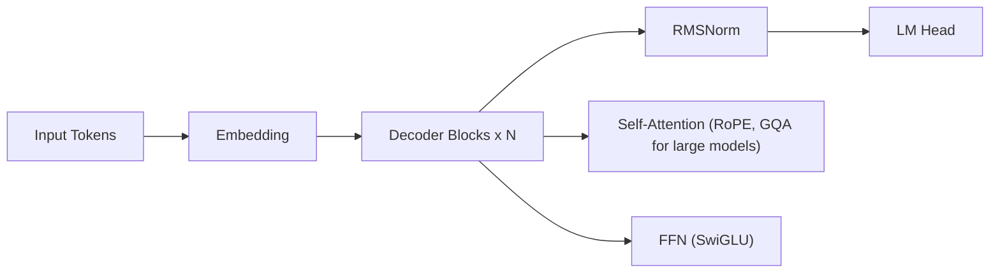

# Llama 2: Open Foundation and Fine-Tuned Chat Models

## 3-Minute Summary

- 这篇报告发布了 `Llama 2` 基础模型与 `Llama 2-Chat` 对齐模型，给开源社区提供了可训练、可复用、可商用（有条件）的中大规模基座。
- 核心问题是: 如何在保持开源可用性的同时，把“训练规模 + 数据质量 + 对齐效果”推进到接近当时闭源助手的可用水平。
- 最值得学习的三点:
  - `pretraining` 和 `post-training` 分层设计，而不是把所有目标混在一次训练里。
  - 对齐阶段采用 `SFT + RM + PPO` 的经典流水线，并显式加入安全对齐。
  - 报告对“哪些信息公开、哪些未公开”边界比较清晰，适合学习如何读技术报告。

## Source Facts

- 原始材料类型:
  - model technical report（arXiv:2307.09288）。
- 发布时间:
  - 2023-07-18。
- 模型范围:
  - 7B / 13B / 70B 的 base 与 chat 版本。
- 明确公开的信息:
  - 预训练 token 量级（`2T`）、上下文长度（`4K`）、对齐训练主流程、核心 benchmark 趋势。
- 未完全公开的信息:
  - 训练数据精细配比、全部清洗规则细节、完整训练超参和工程管线细节。

## Problem Setting

- 目标任务:
  - 通用语言理解、对话、代码与推理相关的生成任务。
- 目标用户/场景:
  - 开源研究、企业私有化部署、下游指令微调与应用开发。
- 相比 Llama 1 的重点提升:
  - 更大训练数据与更长上下文。
  - 更系统的对齐流程与更实用的 chat 体验。
  - 在多项公开 benchmark 上更强的综合表现。

## Architecture

- 整体架构:
  - 仍是 decoder-only Transformer，延续 Llama 1 的主干。
- 关键模块:
  - `RMSNorm`、`SwiGLU`、`RoPE`。
  - `GQA`（主要用于更大模型变体）以降低推理时 KV cache 成本。
- 是否使用 MoE/MLA/MTP/多模态:
  - 本代不是 MoE 路线，也没有 MLA/MTP/多模态作为核心结构创新。
- 设计动机:
  - 保持架构稳定，把主要优化预算投入到数据规模、训练稳定性和后训练可用性。

### 结构图（根据论文主干结构重绘）



- 可对照原文结构示意图阅读，重点看“架构变化不激进，但训练配方升级明显”。

## Data and Pre-training

- 数据来源与规模:
  - 公开来源为主，训练总量约 `2T` tokens。
- 数据清洗与配比:
  - 报告明确做了质量过滤与去重，但未公开完整配方明细。
- tokenizer / vocab:
  - 使用子词 tokenizer（延续家族体系），目标是兼顾通用文本与代码场景。
- 训练阶段:
  - 先做 base pretraining，再做 chat 对齐训练。
- 关键 recipe:
  - 在不引入复杂新架构前提下，通过更长序列和更大规模训练获取能力增益。

## Post-training and Alignment

- SFT:
  - 先用高质量指令数据把 base model 拉到“可对话”分布。
- Preference optimization / RL:
  - 使用 `Reward Model + PPO` 优化人类偏好目标。
  - 可把目标抽象为:
```text
max_pi  E_{y~pi(.|x)}[r(x,y)] - beta * KL(pi || pi_ref)
```
  - 这里 `KL` 项控制策略不要偏离参考模型过快，避免输出退化。
- instruction following:
  - 强调 helpfulness 与回答结构稳定性。
- 安全对齐:
  - 单独加入 safety 相关数据与评估流程，避免“能力提升=风险上升”。

## Evaluation

- 重点 benchmark:
  - 常见语言理解、常识推理、代码和对话评估任务。
- 对比基线:
  - Llama 1、同期开源模型，以及部分闭源模型的公开可比指标。
- 最值得相信的结果:
  - 同家族代际提升趋势（Llama 1 -> Llama 2）。
  - Base 与 Chat 各自目标上的一致改进。
- 需谨慎解读:
  - 人工偏好评测容易受提示词、评测协议和 judge 过程影响。

## Engineering Takeaways

- 训练启发:
  - 架构保守并不意味着效果保守，数据与训练流程常是更大杠杆。
- 推理部署启发:
  - 大模型版本通过 GQA 等机制改善部署成本。
- 数据工程启发:
  - 数据质量和清洗流程对最终可用性影响极大。
- 后训练启发:
  - `SFT -> RM -> PPO` 的分层流水线依然是理解后续方法（DPO/GRPO）的基础。

## What Is Actually Worth Learning

- 值得抄作业:
  - 分阶段训练体系和清晰评估目标拆分。
  - 把安全对齐纳入主流程，而不是发布前补丁。
- 工程折中:
  - 对齐强度与模型创造性之间存在天然 trade-off。
  - 大模型能力和推理成本之间存在明显边际收益递减。
- 难直接复用:
  - 大规模数据采集与人工偏好标注体系。

## Cross-References

- 相关模型:
  - [Llama 3](llama3.md)
  - [Qwen2](../qwen/qwen2.md)
  - [DeepSeek-V3](../deepseek/deepseek_v3.md)
- 相关论文:
  - [RoFormer / RoPE](../../papers/architecture/roformer.md)
  - [PPO](../../papers/alignment/ppo.md)
  - [DPO](../../papers/alignment/dpo.md)
- 相关专题:
  - [Post-training](../../topics/post_training.md)
  - [Long Context](../../topics/long_context.md)

## Open Questions

- 未公开细节:
  - 数据混合精细配方、完整训练调参日志和部分系统实现细节。
- 可能依赖隐藏设置的结论:
  - 某些对齐收益是否高度依赖特定数据筛选策略。
- 后续追踪:
  - Llama 2 到 Llama 3 的 recipe 演进路径，尤其是数据与 post-training 的变化。

## References

- Primary source:
  - [Llama 2: Open Foundation and Fine-Tuned Chat Models (arXiv:2307.09288)](https://arxiv.org/abs/2307.09288)
- Supplemental material:
  - [Meta Llama official site](https://llama.meta.com/)
  - [meta-llama organization](https://github.com/meta-llama)
- Related reading:
  - [The Llama 3 Herd of Models (arXiv:2407.21783)](https://arxiv.org/abs/2407.21783)
  - [InstructGPT (arXiv:2203.02155)](https://arxiv.org/abs/2203.02155)
  - [Direct Preference Optimization (arXiv:2305.18290)](https://arxiv.org/abs/2305.18290)

## Review Checklist

- [x] 关键事实已核查
- [x] 术语和缩写已统一
- [x] 横向对比没有偷换结论
- [x] 已补齐主要链接
