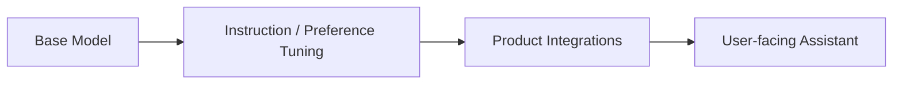

# MiniMax-01

## TL;DR

- MiniMax-01 代表的是“通用能力 + 产品化场景”并行推进路线。
- 对学习者来说，关键是理解如何把模型能力和应用系统（工具、工作流）联动优化。

## Problem Setting

- 目标:
  - 在中文用户场景中提供稳定、可用、可集成的助手能力。

## System-oriented View

## Learning Points

- 模型指标与产品指标经常不一致，需要双指标体系。
- 多模态与工具能力需要独立评估，不应只看单一通用分数。

## Cross-References

- [GLM-4](../zhipu/glm4.md)
- [Kimi](../moonshot/kimi.md)
- [Evaluation](../../topics/evaluation.md)

## References

- Official materials / report: to verify

## Review Checklist

- [ ] 关键事实已核查
- [x] 术语和缩写已统一
- [x] 横向对比没有偷换结论
- [ ] 已补齐主要链接
