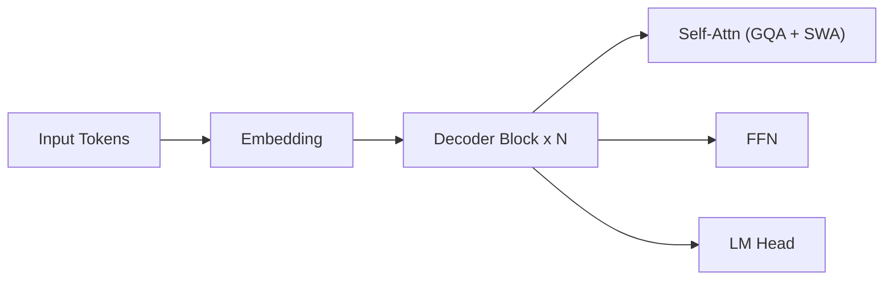

# Mistral 7B

## TL;DR

- Mistral 7B 的核心价值不是“参数更大”，而是用更高效的架构与训练设计，在 7B 规模实现了非常强的综合能力。
- 这篇报告的重要意义在于：它证明了开源小中参数模型仍有很大工程优化空间。
- 学习重点是 `GQA + Sliding Window Attention + 训练配方` 的组合思路。

## 3-Minute Summary

- Mistral 7B 是一个高效 dense decoder-only Transformer。
- 相比同级别模型，它在多项推理与语言任务上表现更好，同时推理成本相对可控。
- 这条路线强调“用结构和系统优化提升单位算力效果”，而不是单纯扩大参数。

## Problem Setting

- 目标问题:
  - 在 7B 级别下，提升质量并控制推理成本。
- 场景:
  - 开源部署、企业私有化推理、下游蒸馏和指令微调。
- 设计目标:
  - 提高长序列处理效率。
  - 在不引入 MoE 复杂性的情况下增强性能。

## Architecture

- 主干:
  - decoder-only Transformer。
- 关键设计:
  - `Grouped-Query Attention (GQA)`：降低 KV cache 成本与带宽压力。
  - `Sliding Window Attention (SWA)`：局部注意力窗口，提升长序列效率。
  - `RoPE` 位置编码。

### 结构草图（按报告思路重绘）

## Data and Pre-training

- 报告明确了训练规模与效率导向，但未公开全部数据细账。
- 学习重点:
  - 小模型同样需要高质量数据与稳健训练策略。
  - 结构优化与训练配方是联动关系，单看某个模块意义有限。

## Post-training and Alignment

- 原始 Mistral 7B 报告更聚焦 base 模型能力。
- instruct 版本通常通过后续 SFT/偏好优化得到，不应混同于 base 结论。

## Evaluation

- 常见结论:
  - 在同参数级别任务上，Mistral 7B 具有强竞争力。
- 阅读注意:
  - 注意对比模型、解码设置、评测协议是否一致。

## Engineering Takeaways

- `GQA` 是中小模型推理降本的关键组件之一。
- `SWA` 在成本和上下文能力之间提供可控折中。
- “高效 dense 路线”是 MoE 之外可持续演进方向。

## What Is Actually Worth Learning

- 值得抄作业:
  - 用架构/系统协同优化提升单位算力回报。
- 工程折中:
  - 局部注意力会牺牲全局依赖建模，需要任务验证。
- 难复用:
  - 大规模训练基础设施与数据闭环。

## Cross-References

- 相关模型:
  - [Mixtral 8x7B](mixtral_8x7b.md)
  - [Llama 2](../llama/llama2.md)
  - [Llama 3](../llama/llama3.md)
- 相关论文:
  - [Transformer](../../papers/architecture/transformer.md)
  - [RoFormer / RoPE](../../papers/architecture/roformer.md)
  - [FlashAttention](../../papers/architecture/flashattention.md)
- 相关专题:
  - [MoE](../../topics/moe.md)
  - [Long Context](../../topics/long_context.md)

## Open Questions

- SWA 与全局任务性能的边界在哪里。
- 同等预算下，dense 优化路线与 MoE 路线的最优切分点在哪里。

## References

- Primary source:
  - [Mistral 7B (arXiv:2310.06825)](https://arxiv.org/abs/2310.06825)
- Related reading:
  - [Mixtral of Experts (arXiv:2401.04088)](https://arxiv.org/abs/2401.04088)

## Review Checklist

- [x] 关键事实已核查
- [x] 术语和缩写已统一
- [x] 横向对比没有偷换结论
- [x] 已补齐主要链接
