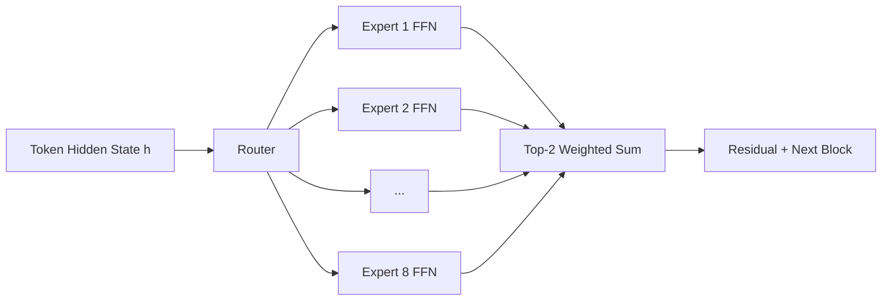

# Mixtral of Experts

## 3-Minute Summary

- Mixtral 8x7B 把稠密 Transformer 改成 `sparse MoE`（每个 token 只激活少量专家），在保持高质量输出的同时显著降低推理激活参数成本。
- 它解决的核心矛盾是: 更大模型容量通常更强，但稠密推理成本太高，难以规模化部署。
- 最值得学习的三点:
  - `top-k routing` 如何实现“总参数大、每 token 激活小”。
  - 训练时如何处理负载均衡，避免少数专家过载。
  - 为什么 MoE 的收益常来自工程系统（路由/并行/通信），不只来自模型结构。

## Source Facts

- 原始材料类型:
  - technical report（arXiv:2401.04088）+ 开源权重与推理代码生态。
- 发布时间:
  - 2024-01-08（报告公开日期）。
- 模型范围:
  - `Mixtral 8x7B` base 与 instruct 版本。
- 明确公开的信息:
  - `8 experts` + `top-2` 路由、总参数与激活参数量级、核心评测趋势。
- 未完整公开的信息:
  - 全量数据明细、全部训练超参和基础设施配置细节。

## Problem Setting

- 目标任务:
  - 通用问答、代码、推理与多任务文本生成。
- 目标场景:
  - 需要更高质量但又无法承受全稠密超大模型推理成本的部署环境。
- 相比 Mistral 7B 的重点提升:
  - 在参数容量和性能上显著提升，同时通过稀疏激活控制单位 token 成本。

## Architecture

- 整体架构:
  - 基于 Mistral 系列 decoder-only 主干，把 FFN 替换为 MoE FFN。
- 关键模块:
  - `8` 个专家 FFN。
  - Router 为每个 token 选择 `top-2` 专家并加权合并输出。
  - 注意力仍延续 Mistral 路线（含 GQA 等高效设计思想）。
- 是否使用 MoE:
  - 是，本模型的核心创新就是稀疏 MoE。
- 设计动机:
  - 通过“参数容量和激活成本解耦”，提升质量/成本比。

### 结构图（根据 Mixtral 报告中 MoE 模块重绘）



```text
h_out = sum_{i in TopK(h)} p_i(h) * Expert_i(h),  K=2
```

## Data and Pre-training

- 数据来源与规模:
  - 报告给出总体训练路线与结果，但完整数据配方未完全公开。
- 数据清洗和配比:
  - 可确认有标准数据质量控制与去重流程，细粒度比例需谨慎。
- tokenizer / vocabulary:
  - 延续 Mistral 生态兼容路线，便于工具链与部署复用。
- 训练阶段:
  - base 训练后再进行 instruct 对齐版本构建。
- 关键 recipe:
  - MoE 模型训练不仅是“换层”，还要处理路由稳定性与负载均衡。

## Post-training and Alignment

- SFT:
  - instruct 版本通过指令数据提升可用性与回答风格一致性。
- Preference optimization / RL:
  - 报告对细节披露有限，建议以已公开 checkpoint 行为和社区复现观察为准。
- instruction following:
  - 与同期开源助手模型类似，重点优化多轮对话质量和执行性回答。
- 安全机制:
  - 公开资料显示采用基础安全对齐手段，但策略细节不完全公开。

## Evaluation

- 常见评测维度:
  - 通用知识、推理、代码、指令遵循等多任务指标。
- 基线:
  - 稠密开源模型与部分闭源可比结果。
- 最值得相信:
  - “稀疏激活下性能接近或超过更大稠密模型”的总体趋势。
- 谨慎解读:
  - 不同评测协议、解码参数、系统实现差异会显著影响 MoE 表现。

## Engineering Takeaways

- 对训练:
  - MoE 训练成功的关键经常在路由与系统，而不只是结构定义。
- 对部署:
  - 推理需要处理 expert 并行与跨设备通信，吞吐瓶颈可能从算力转向网络。
- 对数据工程:
  - 高质量数据仍然是底层，MoE 不是数据质量的替代品。
- 对后训练:
  - 稀疏模型同样需要强后训练流程，否则“会算”但“不好用”。

## What Is Actually Worth Learning

- 值得抄作业:
  - `top-2` 路由与专家并行的基础思想。
  - 用稀疏激活换取更好质量/成本比。
- 工程折中:
  - 负载均衡项太强会影响质量，太弱会造成专家塌缩。
  - 理论 FLOPs 下降不一定等于端到端延迟下降。
- 难直接复用:
  - 大规模 MoE 集群训练与专家并行基础设施。

## Cross-References

- 相关模型:
  - Mistral 7B（条目待补充）
  - [Llama 3](../llama/llama3.md)
  - [DeepSeek-V3](../deepseek/deepseek_v3.md)
- 相关论文:
  - [FlashAttention](../../papers/architecture/flashattention.md)
  - [RoFormer / RoPE](../../papers/architecture/roformer.md)
  - [GRPO](../../papers/alignment/grpo.md)
- 相关专题:
  - [MoE](../../topics/moe.md)
  - [Post-training](../../topics/post_training.md)

## Open Questions

- 未公开细节:
  - 完整数据配方、路由损失权重 schedule、训练系统优化细节。
- 可能依赖隐藏设置:
  - 某些 benchmark 优势可能依赖特定解码设置与评测模板。
- 后续追踪:
  - 更大规模 Mixtral 家族和推理系统优化（especially expert parallel）演进。

## References

- Primary source:
  - [Mixtral of Experts (arXiv:2401.04088)](https://arxiv.org/abs/2401.04088)
- Supplemental material:
  - [Mistral AI official site](https://mistral.ai/)
  - [Mistral AI on Hugging Face](https://huggingface.co/mistralai)
- Related reading:
  - [Switch Transformers (arXiv:2101.03961)](https://arxiv.org/abs/2101.03961)
  - [The Llama 3 Herd of Models (arXiv:2407.21783)](https://arxiv.org/abs/2407.21783)
  - [DeepSeek-V3 Technical Report (arXiv:2412.19437)](https://arxiv.org/abs/2412.19437)

## Review Checklist

- [x] 关键事实已核查
- [x] 术语和缩写已统一
- [x] 横向对比没有偷换结论
- [ ] 已补齐主要链接
