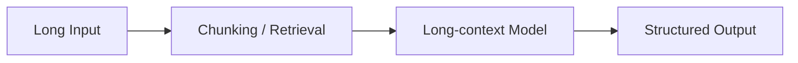

# Kimi

## TL;DR

- Kimi 的代表性价值在于长上下文能力和助手体验，尤其在文档/检索型任务中常被提及。
- 学习重点是“长上下文可用性”而不只是窗口数字本身。

## Problem Setting

- 目标:
  - 提升超长文本读取、定位和摘要能力。
- 典型场景:
  - 大文档问答、长会话、资料整理、研究助手。

## Long-context Lens

- 训练与推理要同时考虑:
  - 位置编码外推
  - 注意力系统优化
  - 长文评测协议

## What Learners Should Focus On

- “可处理长度”与“可用长度”是两件事。
- 长上下文性能必须看检索准确率和多跳一致性，不只看宣传窗口。

## Cross-References

- [Llama 3](../llama/llama3.md)
- [Qwen2.5](../qwen/qwen2_5.md)
- [Long Context](../../topics/long_context.md)

## References

- Official materials / report: to verify

## Review Checklist

- [ ] 关键事实已核查
- [x] 术语和缩写已统一
- [x] 横向对比没有偷换结论
- [ ] 已补齐主要链接
