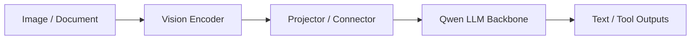

# Qwen2.5-VL

## TL;DR

- Qwen2.5-VL 是 Qwen 家族的主流多模态分支，重点覆盖图像理解、文档理解和多模态指令跟随。
- 学习重点不是“图像输入”本身，而是多模态对齐与 instruction tuning 如何结合。

## Problem Setting

- 目标:
  - 把视觉信息稳定映射到语言推理与指令执行。
- 典型场景:
  - OCR/图表理解、长文档问答、截图助手、视觉工具调用。

## Architecture (Learning View)

- 核心是跨模态连接层设计和训练阶段划分，而不是单一 backbone。

## Training Pipeline

1. 多模态对齐预训练（看得懂图像/版面）。
2. 多模态 instruction tuning（会按指令回答）。
3. 安全与风格对齐（可用性）。

## Evaluation Lens

- 感知: OCR、图表、定位。
- 推理: 跨模态推理与组合问题。
- 交互: 多轮指令和工具执行一致性。

## What Learners Should Watch

- 不要只看 VQA 分数，要看文档和复杂页面任务。
- 区分“看见了”与“推理对了”。
- 留意幻觉类型（视觉误读 vs 语言猜测）。

## Cross-References

- [Qwen2.5](qwen2_5.md)
- [Qwen2-Audio](qwen2_audio.md)
- [Multimodal LLM](../../topics/multimodal.md)
- [Evaluation](../../topics/evaluation.md)

## References

- Official materials / report: to verify

## Review Checklist

- [ ] 关键事实已核查
- [x] 术语和缩写已统一
- [x] 横向对比没有偷换结论
- [ ] 已补齐主要链接
