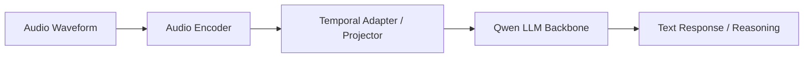

# Qwen2-Audio

## TL;DR

- Qwen2-Audio 关注语音/音频到文本推理与对话能力，把 ASR、音频理解和指令跟随结合。
- 学习重点是“多模态输入统一到 LLM 推理”的训练流程，而不是单一语音识别精度。

## Problem Setting

- 目标:
  - 让模型处理真实音频场景中的识别、理解和交互任务。
- 典型任务:
  - 语音问答、音频内容摘要、事件识别、语音助手。

## Architecture (Learning View)

## Training Notes

1. 音频表征学习（识别与事件理解）。
2. 音频-文本对齐。
3. 音频指令微调与对话风格对齐。

## Evaluation Lens

- 识别质量（WER 类指标）。
- 理解质量（音频问答与事件判断）。
- 交互质量（多轮稳定性与指令遵循）。

## Common Pitfalls

- 把 ASR 准确率当作唯一指标。
- 忽略噪声、口音、长音频切分带来的真实退化。

## Cross-References

- [Qwen2.5-VL](qwen2_5_vl.md)
- [Qwen2.5](qwen2_5.md)
- [Multimodal LLM](../../topics/multimodal.md)

## References

- Official materials / report: to verify

## Review Checklist

- [ ] 关键事实已核查
- [x] 术语和缩写已统一
- [x] 横向对比没有偷换结论
- [ ] 已补齐主要链接
