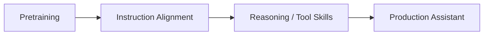

# Step-2

## TL;DR

- Step-2 可视为阶跃星辰路线中的主力通用模型节点，强调综合能力与应用落地。
- 学习重点是“模型能力如何和场景系统协同”，而不是只比单项 benchmark。

## Problem Setting

- 目标:
  - 在多场景助手任务中保持稳定性与可执行性。

## Practical View

## Learning Points

- 工具调用与多模态能力评估应独立展开。
- 需关注失败类型分布，而非只看平均得分。

## Cross-References

- [MiniMax-01](../minimax/minimax_01.md)
- [GLM-4](../zhipu/glm4.md)
- [Post-training](../../topics/post_training.md)

## References

- Official materials / report: to verify

## Review Checklist

- [ ] 关键事实已核查
- [x] 术语和缩写已统一
- [x] 横向对比没有偷换结论
- [ ] 已补齐主要链接
