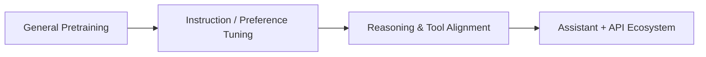

# GLM-4

## TL;DR

- GLM-4 是 GLM 系列主力模型，定位通用助手与工具调用能力。
- 其学习价值在于：国产闭环生态下“通用能力 + 应用能力”的平衡方案。

## Problem Setting

- 目标:
  - 在中文场景保持高可用性，同时具备英文与跨任务泛化能力。
- 典型场景:
  - 企业问答、代码辅助、工具链集成、复杂指令执行。

## System View

## Learning Points

- 通用能力和工具能力是两条并行优化线。
- 评测时要区分“知识问答强”与“任务执行强”。
- 工具调用能力常依赖系统设计，而不是纯模型参数。

## Cross-References

- [ChatGLM3](../chatglm/chatglm3.md)
- [Kimi](../moonshot/kimi.md)
- [Reasoning RL](../../topics/reasoning_rl.md)

## References

- Official materials / report: to verify

## Review Checklist

- [ ] 关键事实已核查
- [x] 术语和缩写已统一
- [x] 横向对比没有偷换结论
- [ ] 已补齐主要链接
