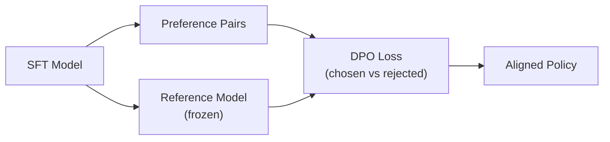

# Direct Preference Optimization

## TL;DR

`DPO` 的核心创新不是“把 PPO 调得更好”，而是把 `RLHF` 里“reward model + RL”的两阶段优化，直接改写成一个基于偏好对的分类目标。它在今天的 LLM 生态位很明确: 当你已经有 `SFT` 模型和 `(prompt, chosen, rejected)` 偏好数据，但不想搭一整套在线 RL 基础设施时，`DPO` 往往是性价比最高的第一步。

## 3-Minute Summary

- 传统 `RLHF` 的标准写法是: 先训练 reward model，再用 `PPO` 之类的 RL 方法优化 policy。
- `DPO` 证明，在常见的 `KL` 约束奖励最大化目标下，最优策略可以直接写成参考策略 `π_ref` 和隐式 reward 的函数，因此不一定要显式训练 reward model。
- 论文最后把问题变成了一个非常工程友好的 loss: 让当前策略相对参考策略，更偏向 `chosen`，更不偏向 `rejected`。
- 这使得偏好优化第一次真正变成“像监督学习一样能稳定跑起来”的流程，所以后来 `SFT -> DPO` 几乎成了开源后训练的默认 recipe 之一。

## 这篇论文解决什么问题

经典 `RLHF` 路线有三个长期痛点:

- 训练链路长。你至少要维护 `policy`、`reference policy`、`reward model`，有时还要有 `value model`。
- 训练不稳定。`PPO` 对采样温度、KL 系数、value loss、优势估计都很敏感。
- 算力和工程成本高。在线 rollout、反复采样和多模型同步让实验周期很长。

`DPO` 的问题意识非常明确: 如果最终目标只是“让模型更偏向人类喜欢的回答，同时不要偏离参考模型太远”，那么有没有办法直接在偏好数据上训练 policy，而不是绕一圈先学一个 reward model 再做 RL？

这也是为什么这篇论文在 LLM 训练史上的地位很特殊。它不是提出了一个更复杂的后训练框架，而是把原本高度工程化的问题，压缩成了一个更简洁的数学形式。

## 核心技术拆解

### Problem Formulation

给定一个 prompt `x`，以及对应的偏好对:

- `y_w`: 人类更偏好的回答 `chosen`
- `y_l`: 人类较不偏好的回答 `rejected`

目标是学习一个新策略 `πθ`，满足两件事:

- 在 reward 意义上更喜欢 `y_w`
- 相比参考策略 `π_ref` 不要漂移过大

标准的 `RLHF` 目标可以写成“最大化期望 reward，同时加一个对参考模型的 KL 约束”。论文的关键观察是: 在这个目标下，最优策略具有闭式形式，大致可以理解为:

```text
π*(y|x) ∝ π_ref(y|x) * exp(r(x, y) / β)
```

这里 `β` 控制“离参考策略有多远”。`β` 越小，模型越激进；`β` 越大，模型越保守。

### Method

如果你接受上面的最优策略形式，那么 reward 可以反过来由 policy 和 reference policy 的对数概率差来表示。再结合 `Bradley-Terry` 偏好模型，就能把“chosen 胜过 rejected”的概率写成一个 logistic 目标。

工程上最常见的 `DPO` loss 可以理解为:

```text
L_DPO = - log σ( β * [
  log πθ(y_w|x) - log π_ref(y_w|x)
  - log πθ(y_l|x) + log π_ref(y_l|x)
])
```

读这个式子时，最重要的是抓住它的物理意义，而不是背公式:

- `log πθ(y_w|x)` 变大: 当前 policy 更愿意生成 chosen
- `log πθ(y_l|x)` 变小: 当前 policy 更不愿意生成 rejected
- `π_ref` 提供锚点: 防止策略无约束地发散
- `β` 控制偏好更新幅度

和 `PPO` 相比，`DPO` 做的事情其实朴素得多: 它直接优化相对偏好边界，而不再显式训练一个 reward model 然后做在线策略改进。

### Why It Works

`DPO` 的理论价值在于，它不是拍脑袋设计了一个 pairwise loss，而是从标准 `RLHF` 目标推导出了这个 loss。成立的关键前提有两个:

- 偏好数据满足类似 `Bradley-Terry` 的成对比较建模
- 训练目标仍然是“reward 最大化 + 对参考策略的 KL 约束”

从直觉上看，`DPO` 在做三件事:

1. 提高当前策略对 `chosen` 的相对支持度。
2. 降低当前策略对 `rejected` 的相对支持度。
3. 用 `reference model` 把更新限制在“可控偏移”的范围内。

这也是它比“只最大化 chosen 的 logprob”更稳的原因。单纯拉高 chosen 的概率很容易学到长度偏置、格式偏置或数据集偏置；`DPO` 强调的是相对偏好差，而不是绝对似然。

### Systems / Efficiency Angle

`DPO` 最强的工程价值不是微观上赢几个点，而是把后训练系统大幅简化了。它直接删掉了两块最重的基础设施负担:

- 不再需要显式训练 reward model 才能开始 policy optimization
- 不再需要在线 rollout + actor-critic 风格的 RL 闭环

这带来的收益很实际:

- 训练实现更像普通 `SFT`
- 训练稳定性明显好于 `PPO`
- 调参空间更小，主要超参集中在 `β`、学习率、batch size 和长度处理策略
- 偏好优化可以完全离线完成，便于在开源社区复现



## 训练或实验设置

论文主要验证了三个场景:

- `IMDb sentiment control`
- `Reddit TL;DR summarization`
- `Anthropic Helpful-Harmless dialogue`

这三个场景的选择很有代表性:

- `sentiment control` 适合画出 `reward-KL` frontier，直接看优化效果
- `summarization` 更接近真实偏好优化任务
- `helpful-harmless` 则是后续聊天模型最常见的对齐场景

评测方式也有两个层次:

- 自动指标或 reward/KL 曲线
- `GPT-4` 作为 judge 的 pairwise 比较，并辅以人工评估校验

论文中最有价值的实验结论不是某一个绝对数字，而是这几个稳定趋势:

- 在 `reward-KL` frontier 上，`DPO` 能明显优于论文中的 `PPO` 基线
- 在 `TL;DR` 和 `HH` 任务上，`DPO` 的偏好胜率通常高于 `PPO`
- `DPO` 对采样温度和解码设置更稳，退化程度更小
- 在分布外测试中，`DPO` 没有因为“离线偏好训练”而明显崩掉泛化

如果你是把这篇论文当“学习 recipe”来读，实验部分真正值得记住的是一句话: `DPO` 不是在所有场景都神奇碾压，但它把偏好优化变成了一个更稳定、更便宜、更容易复用的默认选项。

## 与 LLM 训练栈的关系

### 它在完整训练流程里的位置

`DPO` 并不替代预训练，也不替代 `SFT`。它最自然的位置是:

```text
Pretraining -> SFT -> DPO -> 可选在线RL / 规则奖励优化
```

也就是说，`DPO` 更像后训练的第一层“偏好对齐器”。当模型已经学会基本能力和指令格式后，`DPO` 用人类偏好把输出分布往“更像人类想要的答案”方向拉。

### 关键超参与工程取舍

对实践来说，最关键的不是背原论文表格，而是理解几个真正会影响训练结果的旋钮:

- `β`: 控制更新激进程度。过大时优化接近保守蒸馏；过小时容易偏离 reference 太远。
- `chosen/rejected` 质量: 如果偏好对噪声很大，`DPO` 会非常诚实地把噪声学进去。
- 长度处理: 长回答往往天然有更低总 logprob，若不做长度归一或数据控制，容易学出长度偏置。
- 参考模型选择: 通常就是 `SFT` 检查点；如果 reference 太弱或分布不匹配，KL 锚点会失真。

### 什么时候适合用 DPO

适合:

- 你已经有较高质量偏好对数据
- 你想快速做一个稳定的 aligned checkpoint
- 你不想承担在线 RL 的工程负担

不太适合单独使用的情况:

- 强依赖环境交互、长程搜索或工具调用反馈
- 偏好数据覆盖不足，需要在线探索新策略
- 奖励高度可验证且可以从规则直接给出，此时 `GRPO / PPO + rule-based reward` 往往更直接

## 相关代码 / 复现

- 官方论文: [Direct Preference Optimization: Your Language Model is Secretly a Reward Model](https://arxiv.org/abs/2305.18290)
- HTML 阅读版: [ar5iv HTML](https://ar5iv.labs.arxiv.org/html/2305.18290v3)
- Hugging Face `TRL` 实现: [DPOTrainer](https://huggingface.co/docs/trl/main/en/dpo_trainer)
- AlpacaFarm 相关实现参考: [tatsu-lab/alpaca_farm](https://github.com/tatsu-lab/alpaca_farm)

如果你想从“能跑起来”而不是“完全复现实验”开始，`TRL` 的 `DPOTrainer` 足够作为工程起点。真正难的通常不是 loss 本身，而是数据清洗、长度控制、reference model 选择和偏好对构造质量。

## 真正值得学的点

- `DPO` 的真正突破是“把 RLHF 从在线 RL 问题降成离线分类问题”。这是方法论层面的简化，不只是一个新 loss。
- 它用 `reference model` 把“别偏太远”的约束显式保留了下来，所以比很多 naive pairwise objective 更稳。
- 它极大推动了开源后训练的发展，因为第一次有了一个不依赖复杂 RL 基础设施、又明显强于只做 SFT 的默认方案。

## 局限与疑问

- 理论前提并不是无条件成立的。`DPO` 依赖特定偏好模型和 KL 约束形式，不能把所有对齐问题都无缝重写成 `DPO loss`。
- 它本质上仍是离线学习。如果 preference data 没覆盖到某类行为，`DPO` 不会像在线 RL 一样主动探索新策略。
- 在可验证推理任务上，`DPO` 往往不如直接用规则奖励做 RL 那么自然，因为它学习的是“人偏好哪个答案”，而不是“答案对不对”。
- 原论文的实验规模并不是今天超大模型的完整情形，所以后续工业界对 `DPO` 的成功，部分来自工程扩展而不是这篇论文自身已经完全证明。

## 延伸阅读

- InstructGPT / RLHF（条目待补充）
- [PPO](ppo.md)
- [GRPO](grpo.md)
- [Qwen2 Technical Report](../../models/qwen/qwen2.md)
- [Post-training](../../topics/post_training.md)
- [Reasoning RL](../../topics/reasoning_rl.md)

## Review Checklist

- [x] 方法定义已核查
- [x] 关键公式没有抄错
- [x] 实验结论没有被过度解释
- [x] 已说明与主流 LLM 实践的关系
