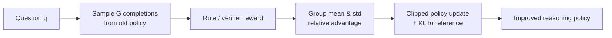

# Group Relative Policy Optimization

## TL;DR

`GRPO` 的核心创新是: 不再训练一个和 policy 同量级的 value model，而是对同一个问题一次采样出一组回答，用组内相对 reward 直接构造 advantage，再做 `PPO` 风格更新。它在今天 LLM 生态里的位置非常清晰: 尤其适合数学、代码、可验证推理这类可以自动打分的任务，也是后来 `DeepSeek-R1` 这类 reasoning model 强化学习路线的重要基础。

## 3-Minute Summary

- `GRPO` 最早是在 `DeepSeekMath` 里提出的，不是一篇孤立的“纯算法论文”，而是和数学模型训练 recipe 一起出现的。
- 它要解决的核心问题是: 对大语言模型做 RL 时，`PPO` 通常要训练一个 critic / value model，这会显著增加显存、算力和训练不稳定性。
- `GRPO` 的做法是对每个 prompt 从旧策略采样 `G` 个回答，基于这组回答的 reward 均值和方差构造相对优势，从而省掉 critic。
- 这个设计在 reasoning 场景里特别有效，因为很多任务的 reward 可以通过规则直接算出来，例如数学答案是否正确、代码是否通过测试、格式是否满足要求。

## 这篇论文解决什么问题

把 `RL` 真正搬到 LLM 上时，很多人低估了 value model 的成本。对一个几亿、几十亿甚至上百亿参数的 policy 来说，再配一个 critic 会带来几类问题:

- 显存和计算成本明显增加
- value learning 本身很不稳定，容易成为训练瓶颈
- 当 reward 稀疏、波动大、分布不断变化时，critic 很难学准
- 工程实现复杂度上升，策略更新和 value 更新的节奏需要同时调

在数学和代码这种“可以自动验证答案对不对”的任务里，这个负担尤其显得浪费。因为这里最重要的问题不是“怎么估一个模糊的人类偏好值”，而是“对同一道题的多个答案，哪个更好”。

`GRPO` 正是在这个背景下提出的。它的目标不是构造更复杂的 RL 框架，而是砍掉 critic，把策略梯度更新建立在组内相对比较上。

## 核心技术拆解

### Problem Formulation

对每一个问题 `q`，从旧策略 `π_old` 一次采样 `G` 个候选回答:

```text
{o_1, o_2, ..., o_G} ~ π_old(. | q)
```

然后为每个回答打 reward `r_i`。在数学推理里，reward 往往由规则自动给出，例如:

- 最终答案是否正确
- 是否使用了规定格式
- 是否通过单元测试或符号校验

和 `PPO` 不同，`GRPO` 不再训练 `V(q)` 或 `V(q, o)` 这样的 value model，而是直接在这组样本内部做相对归一化。

### Method

`GRPO` 的核心步骤可以概括成四步:

1. 对同一个 prompt 采样一组回答。
2. 对每个回答算 reward。
3. 用组内均值和标准差，把 reward 归一化成相对 advantage。
4. 用 `PPO` 风格的 clipped objective 更新 policy，并保留对参考模型的 KL 约束。

组内 advantage 的直觉写法可以理解为:

```text
A_i = (r_i - mean(r_1...r_G)) / std(r_1...r_G)
```

这里最关键的是“相对”二字。`GRPO` 并不关心某个回答的绝对 reward 有多高，而更关心在同一题的多条候选里，它相对其他回答是更好还是更差。

后续优化仍然保留了 `PPO` 的核心精神:

- 使用新旧策略概率比 `πθ / π_old`
- 做 clipping，防止一步更新过大
- 加对参考策略 `π_ref` 的 KL 正则，抑制策略漂移

因此你可以把 `GRPO` 看作:

```text
PPO - critic + group-relative advantage
```

这也是它名字的字面含义。

### Why It Works

`GRPO` 生效的前提有两个:

- 对同一 prompt 的多次采样质量确实有可区分差异
- reward 至少在组内是可比较、可排序的

在数学推理场景里，这个前提非常合理。因为同一道题下，模型可能给出:

- 完全正确的解答
- 思路基本对但最终算错的解答
- 格式错、无法解析的解答
- 完全离题的解答

这时，组内相对 baseline 往往比学习一个全局 value function 更容易。原因是:

- 它只需要区分“这组里面谁更好”，而不是估计一个绝对值函数
- 避免了 critic 对 reward scale 和分布漂移的敏感性
- 当 reward 来自规则验证时，优势比较天然更可靠

从工程视角看，`GRPO` 最重要的不是理论上多优雅，而是它把“超大模型 RL 的基础设施门槛”降下来了。

### Systems / Efficiency Angle

`GRPO` 的系统收益主要来自删除 critic:

- 少一个和 policy 同量级的网络，显存压力显著下降
- 少一条 value loss 反向链路，训练图更简单
- 不用为 critic 单独做稳定性调参
- 更容易把更多预算留给更大的 group size、更多 rollout 或更长回答

当然，它并不是“免费午餐”。你把 critic 的成本换成了组采样成本:

- 每个 prompt 要采样 `G` 个回答
- 如果 `G` 太小，baseline 噪声大
- 如果 `G` 太大，采样成本会快速上升

所以 `GRPO` 的核心工程问题从“怎么训练好一个 value model”，变成了“怎么选一个划算的 group size，并让 reward 足够可靠”。



## 训练或实验设置

`GRPO` 不是脱离任务单独评估的，它出现在 `DeepSeekMath` 整体 pipeline 中。这个背景非常关键，因为它说明作者不是为了 硬造一个新缩写，而是在解决“如何把 RL 稳定地用于数学推理模型”这个实际问题。

### 数据与模型背景

- 基础模型来自 `DeepSeek-Coder-Base-v1.5 7B`
- 团队通过四轮迭代式的 Common Crawl 数学网页挖掘，构建了大规模数学语料库
- 后续进行了持续预训练，把模型往数学领域继续推深
- 再在数学 instruction data 上做监督微调
- 最后才进入 `GRPO` 强化学习阶段

这个顺序本身就很值得学。`GRPO` 不是拿来凭空创造数学能力的，而是用于把已有数学能力进一步“拉成更稳定的推理策略”。

### 结果怎么读

论文里 `DeepSeekMath-RL 7B` 的代表结果是:

- `MATH` benchmark 上无工具达到 `51.7%`
- 加 self-consistency 后达到 `60.9%`

这说明两点:

- 规则奖励驱动的 RL 确实能显著推高数学推理能力
- 采样和 reranking 仍然很重要，policy 提升和 test-time compute 是叠加关系

### 对后续 reasoning model 的意义

虽然 `DeepSeekMath` 的规模和今天最强推理模型不在一个量级，但它把一条后来被反复验证的路线讲清楚了:

```text
高质量领域预训练 -> 领域SFT -> 可验证奖励RL
```

这条路线后来在 `DeepSeek-R1` 等工作里被进一步放大和产品化。

## 与 LLM 训练栈的关系

### 它在 当前 LLM 训练栈 里的位置

`GRPO` 更适合后训练而不是预训练。准确说，它属于“reasoning-centric RL”这一层，典型位置是:

```text
Pretraining -> SFT -> DPO / SFT refinement -> GRPO-like RL
```

当任务 reward 可以自动验证时，`GRPO` 往往比基于人偏好的 `DPO` 更直接，因为它优化的是“答案是否正确”，不是“人更喜欢哪个答案”。

### 和 PPO、DPO 的关系

- 相比 `PPO`: `GRPO` 去掉了 critic，核心优势是更省显存、更易稳定。
- 相比 `DPO`: `GRPO` 是在线 RL，需要采样 rollout；`DPO` 是离线偏好优化，不需要环境交互。
- 相比传统 `RLHF`: `GRPO` 更适合规则可验证任务，不太依赖 reward model 的主观打分。

### 什么时候最值得用

最适合的任务:

- 数学题求解
- 代码生成与测试驱动验证
- 结构化输出或带格式约束的推理任务
- 可以通过 deterministic checker 打分的 reasoning 任务

不太适合直接照搬的任务:

- 开放式聊天偏好对齐
- 高度主观的 helpfulness / harmlessness 判断
- 缺少可靠 reward verifier 的创作型任务

## 相关代码 / 复现

- 原始来源: [DeepSeekMath: Pushing the Limits of Mathematical Reasoning in Open Language Models](https://arxiv.org/abs/2402.03300)
- DeepSeekMath 官方仓库: [deepseek-ai/DeepSeek-Math](https://github.com/deepseek-ai/DeepSeek-Math)
- Hugging Face `TRL` 实现: [GRPOTrainer](https://huggingface.co/docs/trl/main/en/grpo_trainer)
- 开源复现参考: [huggingface/open-r1](https://github.com/huggingface/open-r1)

如果你要在自己的项目里复现 `GRPO`，最先要想清楚的不是算法细节，而是这三件事:

- 你的 reward 是否足够可靠
- 你的 rollout 成本是否能承受 group sampling
- 你的任务是否真的适合“组内相对比较”而不是偏好对学习

## 真正值得学的点

- `GRPO` 的关键洞察不是“组采样”本身，而是“在 reasoning 任务里，critic 也许不是必需品”。
- 它把 RL 的难点从“学一个绝对值函数”换成“在同题样本中做相对比较”，这非常贴合可验证推理任务的结构。
- 它是后续大模型 reasoning RL 里最值得理解的一块基础砖，因为很多后续工作即便不完全照抄，也沿用了相同的思想框架。

## 局限与疑问

- `GRPO` 极度依赖 reward verifier 的质量。如果 checker 错了，优化方向会整体跑偏。
- 当组内 reward 非常接近或几乎全错时，relative baseline 提供的信息会很弱。
- 它没有解决 token-level credit assignment 的根本问题，仍然是把序列级 reward 回传到整段生成上。
- 在开放式聊天任务中，组内相对 reward 往往没有数学和代码任务那么可靠，因此不能把 `GRPO` 当成通用对齐银弹。

## 延伸阅读

- [DeepSeek-R1](../../models/deepseek/deepseek_r1.md)
- [DeepSeek-V3](../../models/deepseek/deepseek_v3.md)
- [DPO](dpo.md)
- [PPO](ppo.md)
- [Reasoning RL](../../topics/reasoning_rl.md)
- [Post-training](../../topics/post_training.md)

## Review Checklist

- [x] 方法定义已核查
- [x] 关键公式没有抄错
- [x] 实验结论没有被过度解释
- [x] 已说明与主流 LLM 实践的关系
