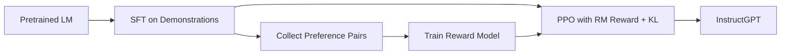

# InstructGPT / RLHF

## 3-Minute Summary

- 这篇论文建立了现代 `RLHF` 的标准三阶段流程：`SFT -> Reward Model -> PPO`。
- 它要解决的问题是：预训练模型“会说”但“不按人类意图说”。
- 这篇论文的重要性在于，它把“对齐”从概念变成了可重复的工程流程。

## Problem Definition

- 输入:
  - 预训练语言模型。
  - 人类标注的示例答案和偏好对。
- 输出:
  - 更遵循指令、更少有害输出的对齐模型。
- 目标:
  - 提升 helpfulness / honesty / harmlessness，且保持语言能力。

## Method

- Stage 1: SFT
  - 用人工示范数据微调基础模型。
- Stage 2: Reward Modeling
  - 用偏好比较数据训练奖励模型 `r_phi(x,y)`。
- Stage 3: PPO
  - 用奖励模型做优化，同时加 KL 约束防止策略漂移。

### 核心目标（简化）

```text
max_pi E[r_phi(x,y)] - beta * KL(pi || pi_sft)
```

### 流程图（重绘）



## Why It Works

- SFT 先把模型拉到“能跟指令交互”的区域。
- Reward model 引入更细粒度的人类偏好信号。
- PPO 在 KL 约束下逐步优化行为，减少灾难性偏移。

## Experiments

- 论文比较了 SFT、PPO 以及不同模型规模下的对齐效果。
- 关键结论:
  - 小参数对齐模型在偏好上可优于更大但未对齐模型。
  - 人类偏好评估是后训练价值判断的重要维度。

## Implementation Notes

- RLHF 成功依赖数据质量，不只是算法。
- 常见风险:
  - reward hacking
  - 标注偏差
  - 目标冲突（helpfulness 与 harmlessness）

## Relationship to LLM Practice

- InstructGPT 奠定了后续开源/闭源对齐流水线基线。
- 后续 DPO、GRPO 等方法可看作对 InstructGPT 流程的工程简化或任务特化。

## Limitations

- 人类反馈规模昂贵且有偏差。
- reward model 并不等于“真实人类价值函数”。
- 结果对标注协议和提示分布敏感。

## Cross-References

- 相关模型报告:
  - [Llama 2](../../models/llama/llama2.md)
  - [Qwen2](../../models/qwen/qwen2.md)
  - [DeepSeek-R1](../../models/deepseek/deepseek_r1.md)
- 相关论文:
  - [PPO](ppo.md)
  - [DPO](dpo.md)
  - [GRPO](grpo.md)
- 相关专题:
  - [Post-training](../../topics/post_training.md)
  - [Reasoning RL](../../topics/reasoning_rl.md)

## References

- Primary source:
  - [Training language models to follow instructions with human feedback (arXiv:2203.02155)](https://arxiv.org/abs/2203.02155)
- Follow-up work:
  - [Direct Preference Optimization (arXiv:2305.18290)](https://arxiv.org/abs/2305.18290)
  - [DeepSeekMath / GRPO (arXiv:2402.03300)](https://arxiv.org/abs/2402.03300)

## Review Checklist

- [x] 方法定义已核查
- [x] 关键公式没有抄错
- [x] 实验结论没有被过度解释
- [x] 已说明与主流 LLM 实践的关系
