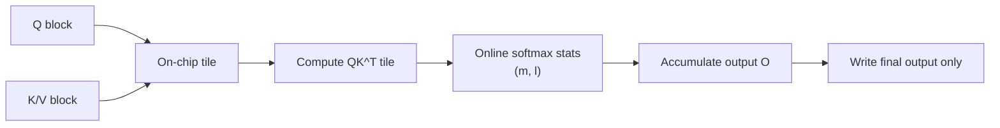

# FlashAttention

## TL;DR

`FlashAttention` 的核心创新不是改 attention 公式，而是改 attention 的执行方式: 通过分块计算、在线 softmax 和重算策略，避免把完整的 `N x N` attention matrix 落到高带宽显存里。它在 LLM 生态里的位置不是“模型结构创新”，而是“训练与推理基础设施创新”，几乎是现代长上下文和高吞吐 Transformer 的底层标配之一。

## 3-Minute Summary

- 标准 self-attention 的理论复杂度大家都知道是 `O(N^2)`，但实际训练时更致命的往往不是 FLOPs，而是显存读写，也就是 `IO` 开销。
- 传统实现会显式写出注意力分数矩阵和 softmax 结果，这会造成大量 `HBM` 访问。
- `FlashAttention` 的关键做法是把 `QK^T`、softmax 和 `AV` 融合成一个分块 kernel，在片上 `SRAM` 里尽量完成计算，只维护每一行 softmax 所需的统计量。
- 它是 exact attention，不是近似方法，所以性能提升不是靠牺牲精度换来的。

## 这篇论文解决什么问题

如果只看公式，标准 attention 非常直接:

```text
Attention(Q, K, V) = softmax(QK^T / sqrt(d)) V
```

但从系统实现角度看，这个公式隐藏了一个大问题。对于长度为 `N` 的序列，很多框架会显式构造:

- `S = QK^T`，大小约为 `N x N`
- `P = softmax(S)`，大小仍然约为 `N x N`

这些中间结果往往比 `Q/K/V` 本身还吃显存，而且会引发大量显存带宽消耗。序列一长，attention 经常不是算不动，而是“搬数据搬不动”。

`FlashAttention` 的问题意识很纯粹:

- 真正拖慢 attention 的瓶颈是不是 `IO`，而不是算术计算？
- 能不能重新安排计算顺序，让中间矩阵不落到 `HBM`？
- 如果能做到这一点，能不能在不近似 attention 的前提下同时提升速度和内存效率？

论文给出的答案是肯定的。

## 核心技术拆解

### Problem Formulation

论文采用的是一种典型的“IO-aware algorithm”视角。作者不只是统计 FLOPs，而是显式分析:

- 哪些 tensor 必须进出 `HBM`
- 哪些数据可以留在更快但更小的片上 `SRAM`
- 不同 attention 实现会产生多少次内存搬运

关键判断是: 标准 attention 实现反复把 `Q/K/V` 和中间矩阵在 `HBM` 与 `SRAM` 之间搬来搬去，造成了巨大的带宽浪费。

### Method

`FlashAttention` 的核心做法可以概括成三件事:

1. 把 `Q`、`K`、`V` 按 block 分块。
2. 每次只在片上处理一个 `Q` block 和若干 `K/V` block。
3. 不显式存完整 attention matrix，而是在线维护 softmax 的统计量并直接累积输出。

最难理解但最关键的一点是在线 softmax。因为 softmax 需要全行归一化，直觉上似乎必须先拿到整行所有分数才能算。但论文利用逐块维护的方式，为每一行保存:

- 当前最大值 `m`
- 当前归一化分母 `l`
- 当前输出累积 `O`

当新的 `K/V` block 到来时，只需更新这三个量，而不需要回写完整的中间 attention matrix。

可以把它理解成“流式 softmax + 流式加权求和”。



### Why It Works

`FlashAttention` 同时提升速度和内存效率，靠的是两个层面的优化:

- 算法层: 重新组织 softmax 计算，避免存储大中间矩阵
- 系统层: 提高片上数据复用，减少 `HBM` 访问次数

论文非常重要的一点是强调它是 `exact attention`。这意味着它并不是像很多长上下文方法那样通过稀疏化、低秩近似或局部窗口来减少计算，而是在数学上仍然等价于标准 attention。

所以这篇论文最值得学习的思想不是某个 CUDA trick，而是一个方法论:

- 深度学习算子优化不能只盯 FLOPs
- 当模型进入大序列、大 batch 场景后，`IO complexity` 往往才是决定速度的关键指标

### Systems / Efficiency Angle

论文报告的代表性结果包括:

- attention kernel speedup 最多可达 `7.6x`
- 在 `GPT-2` 上，序列长度 `1K` 时端到端训练速度最高约 `3x`
- `BERT-large` 训练速度提升约 `15%`
- 在长程依赖任务 `Path-X` 和 `Path-256` 上，配合更长序列训练可达到此前 Transformer 很难做到的效果

另一个重要设计是 backward 的处理方式。`FlashAttention` 不把所有中间结果都存下来，而是在反向传播时重算部分内容。这是经典的“以少量重算换大量显存”的折中。

所以它的本质并不是“算得更少”，而是“搬得更少，存得更少，在必要时重算”。

## 训练或实验设置

论文主要在两类环境中验证方法价值:

### Kernel / Systems Benchmark

- 比较标准 attention kernel 和 `FlashAttention` 的运行时间与显存占用
- 观察不同 head dimension、序列长度和 batch size 下的表现
- 分析 `HBM` 访问与理论 `IO complexity`

### End-to-End Model Benchmark

- `GPT-2` 训练速度
- `BERT-large` 训练速度
- 长程序列建模任务 `Long Range Arena`

这类实验设计非常聪明。它没有只给一个“kernel 更快”的微基准，而是同时证明:

- 单算子更快
- 端到端训练也更快
- 更省内存意味着可以把序列拉长，从而得到额外能力收益

对 LLM 学习者来说，这一点很重要。`FlashAttention` 的价值不是孤立的 kernel 指标，而是它打开了更长上下文和更高吞吐的训练空间。

## 与 LLM 训练栈的关系

### 它在 当前 LLM 训练栈 里的位置

`FlashAttention` 不属于模型架构层，而属于“训练系统 + kernel 实现层”。它典型作用在两个地方:

- 预训练: 更长上下文、更大 batch、更高吞吐
- 推理: 更高 attention kernel 效率，尤其是在长序列 prefilling 阶段

今天很多模型报告里不会把 `FlashAttention` 当成 headline feature 去宣传，但这不代表它不重要。恰恰相反，它已经逐渐变成默认基础设施，以至于很多团队把它当空气。

### 和长上下文方法的关系

它不是 `RoPE`、`ALiBi`、`YaRN` 那样的“让模型看更长”的算法，也不是 `Ring Attention` 那样的分布式注意力策略。它更像基础地板:

- 没有它，你也能做长上下文
- 但有了它，长上下文训练和推理的成本会低很多

所以理解长上下文栈时，最好把它放在这一层次:

```text
位置编码 / 架构外推方法
+ attention kernel 优化
+ 并行与显存管理策略
```

### 什么时候收益最大

- 序列更长时收益更大
- 显存带宽成为瓶颈时收益更大
- 大 batch、高吞吐训练时收益更大

对于很短序列、小模型，收益可能没有那么夸张。但对现代 LLM 的典型工作区间，它几乎总是值得启用。

## 相关代码 / 复现

- 原始论文: [FlashAttention: Fast and Memory-Efficient Exact Attention with IO-Awareness](https://arxiv.org/abs/2205.14135)
- 官方实现: [HazyResearch/flash-attention](https://github.com/HazyResearch/flash-attention)
- PyTorch `scaled_dot_product_attention` 背后的相关实现路径: [PyTorch SDPA docs](https://pytorch.org/docs/stable/generated/torch.nn.functional.scaled_dot_product_attention.html)

如果你在读现代开源模型的训练代码，常见的实际落地方式通常不是直接手写 kernel，而是:

- 依赖 `flash-attn` 库
- 使用框架已集成的 `SDPA` / fused attention backend
- 在支持的 GPU 架构上自动切到更快 kernel

## 真正值得学的点

- `FlashAttention` 最值得学的不是 API，而是“IO-aware algorithm design”这套思考方式。
- 它提醒你: 在大模型系统里，最慢的地方往往不是数学公式看起来最复杂的地方，而是数据搬运最频繁的地方。
- 它证明了“精确算法 + 高效实现”完全可以并存，不一定要先做近似再谈效率。

## 局限与疑问

- 原始 `FlashAttention` 的硬件支持和 head dimension 支持是有限的，很多工程上的易用性提升来自后续 `FlashAttention-2/3` 和框架集成。
- 它优化的是 attention kernel，本身并不解决 `KV cache` 增长、解码阶段线性扩展或 MoE 通信这些其他系统瓶颈。
- 当模型结构、掩码模式或硬件环境比较特殊时，实际能否吃满收益取决于实现细节，不是“打开开关就一定 7x”。

## 延伸阅读

- [RoFormer / RoPE](roformer.md)
- [Ring Attention](../long_context/ring_attention.md)
- [Llama 3](../../models/llama/llama3.md)
- [DeepSeek-V3](../../models/deepseek/deepseek_v3.md)
- [Long Context](../../topics/long_context.md)

## Review Checklist

- [x] 方法定义已核查
- [x] 关键公式没有抄错
- [x] 实验结论没有被过度解释
- [x] 已说明与主流 LLM 实践的关系
