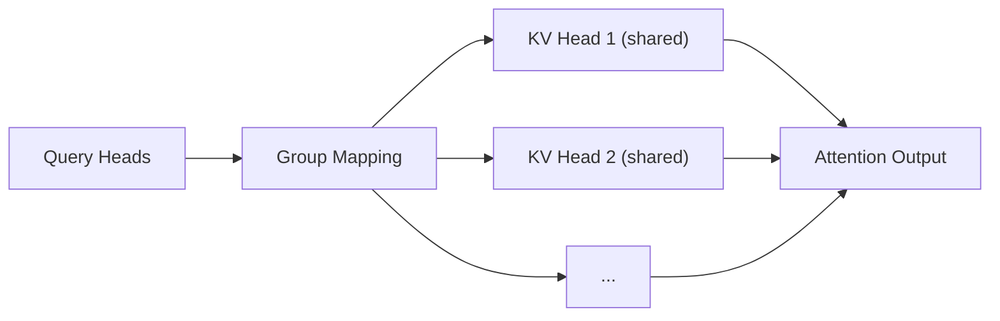

# GQA (Grouped-Query Attention)

## 3-Minute Summary

- GQA 的目标是降低自回归推理中的 KV cache 成本，同时尽量保留多头注意力的质量优势。
- 它要解决的问题是：`MHA` 推理质量好但 KV cache 重，`MQA` 成本低但有时损质量。
- GQA 在两者之间做分组折中，成为许多现代 LLM 的推理优化标配。

## Problem Definition

- 输入:
  - 多头注意力中的 `Q/K/V` 投影。
- 输出:
  - 分组共享 K/V 的注意力结果。
- 目标:
  - 降低内存与带宽压力，提升解码吞吐。

## Method

- 在 GQA 中:
  - `Q` 仍有较多头（query heads）。
  - 若干 query heads 共享一组 `K/V` heads。
- 可把关系理解为:
```text
num_q_heads >> num_kv_heads
group_size = num_q_heads / num_kv_heads
```

### 与 MHA / MQA 对比

| 方法 | KV heads | 推理成本 | 质量风险 |
|---|---|---|---|
| MHA | 与 Q 同数量 | 高 | 低 |
| MQA | 1 | 最低 | 中高 |
| GQA | 介于二者之间 | 中低 | 低到中 |

### 结构图（重绘）



## Why It Works

- 推理瓶颈常在 KV cache 读写，而非纯算力。
- GQA 通过减少 KV heads，显著降低 cache 体积与带宽需求。
- 分组机制比 MQA 更保留头部多样性，减轻质量损失。

## Experiments

- 原论文展示了从 MHA checkpoint 迁移到 GQA 的可行性与效率收益。
- 关键结论:
  - 在合适分组下，GQA 可获得接近 MHA 的质量与更优推理效率。

## Implementation Notes

- 迁移实践:
  - 通常可从已有 MHA 模型继续训练到 GQA 结构。
- 工程要点:
  - 关注 KV cache layout 与 kernel 支持。
  - 分组比例是核心超参，需要任务级评估。

## Relationship to LLM Practice

- Llama 2/3、Mistral 等路线普遍使用 GQA 或其变体。
- GQA 是“高性价比推理优化”而非训练目标本身。

## Limitations

- 极端压缩 KV heads 时仍可能损伤复杂任务表现。
- 具体收益依赖硬件、内核和 batch 形态。

## Cross-References

- 相关模型报告:
  - [Mistral 7B](../../models/mistral/mistral_7b.md)
  - [Llama 2](../../models/llama/llama2.md)
  - [Llama 3](../../models/llama/llama3.md)
- 相关论文:
  - [Transformer](transformer.md)
  - [RoFormer](roformer.md)
  - [FlashAttention](flashattention.md)
- 相关专题:
  - [Long Context](../../topics/long_context.md)

## References

- Primary source:
  - [GQA: Training Generalized Multi-Query Transformer Models from Multi-Head Checkpoints (arXiv:2305.13245)](https://arxiv.org/abs/2305.13245)
- Follow-up work:
  - [Mistral 7B (arXiv:2310.06825)](https://arxiv.org/abs/2310.06825)
  - [The Llama 3 Herd of Models (arXiv:2407.21783)](https://arxiv.org/abs/2407.21783)

## Review Checklist

- [x] 方法定义已核查
- [x] 关键公式没有抄错
- [x] 实验结论没有被过度解释
- [x] 已说明与主流 LLM 实践的关系
