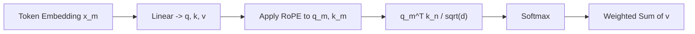

# RoFormer

## 3-Minute Summary

- RoFormer 提出了 `RoPE`（Rotary Position Embedding），把位置信息编码到 `Q/K` 的旋转变换中，让注意力天然感知相对位置。
- 它要解决的问题是: 绝对位置编码难以表达相对位置信号，且在长序列外推时稳定性不足。
- 它重要的原因是: RoPE 变成了后续主流 LLM（Llama、Qwen、Mistral、DeepSeek）的标准位置编码之一。

## Problem Definition

- 输入:
  - token 表示 `x_m`，以及对应位置 `m`。
  - attention 中的 query/key 向量。
- 输出:
  - 融合位置信息后的 `q_m, k_n`，用于计算注意力分数。
- 目标:
  - 在不破坏 Transformer 主结构的前提下，引入可泛化的相对位置信号。
- 相比绝对位置编码:
  - RoPE 不是简单把位置向量相加，而是对向量维度对进行旋转，使注意力分数与 `m-n` 相关。

## Method

- 核心思想:
  - 对 `q`、`k` 的每一对维度应用角度与位置相关的二维旋转。
- 关键公式:
```text
q_m = R(m) q,   k_n = R(n) k
```
  - 其中 `R(t)` 是分块旋转矩阵（每个 2D 子空间一个角频率）。
  - RoPE 的关键性质:
```text
q_m^T k_n = q^T R(n-m) k
```
  - 这说明 attention 分数显式依赖相对距离 `n-m`。
- 算法流程:
  - 线性投影得到 `Q, K`。
  - 对每个位置应用旋转（sin/cos）。
  - 再做标准 scaled dot-product attention。
- 实现细节:
  - 仅改变 `Q/K` 的位置注入方式，对 `V` 不做旋转。
  - 与 FlashAttention、GQA、KV cache 兼容性好。

### 结构图（根据 RoFormer 论文中 RoPE 机制重绘）



## Why It Works

- 直觉:
  - 把“位置”转成“相位差”，模型在比较两个 token 时自然知道相对距离。
- 缓解的问题:
  - 绝对位置编码对相对距离建模不直接。
  - 长序列外推时，某些绝对编码方案会更容易失真。
- 成功前提:
  - 旋转频率设计合理，且与训练上下文长度匹配。
  - 下游训练目标能利用相对位置信号。

## Experiments

- 原论文主要在语言建模与长文本场景比较 RoPE 与其他位置编码方案。
- 常见对比基线:
  - 绝对位置编码、相对位置偏置方法等。
- 关键结论:
  - RoPE 在多项设置下表现稳定，尤其在长序列建模上有优势。
- 可外推价值:
  - 位置编码并非“无关紧要的小组件”，它会直接影响长上下文能力上限。

## Implementation Notes

- 最小实现组件:
  - `sin/cos` 位置缓存。
  - 对 `Q/K` 进行偶奇维度配对旋转的函数。
- 容易踩坑:
  - 维度配对和张量 reshape 错误会导致静默性能下降。
  - 不同框架实现的 `rope_theta` 默认值不一致，迁移时要核对。
  - 超长上下文时需配合外推策略（如 NTK-aware scaling/YaRN 等）。
- 在 LLM 落地:
  - 通常用于 base model 预训练阶段。
  - 推理侧需要与 KV cache 的位置偏移处理严格一致。

## Relationship to LLM Practice

- 显式使用:
  - Llama 系列、Qwen 系列、Mistral 系列、DeepSeek 系列均使用或扩展了 RoPE 路线。
- 适用阶段:
  - 主要影响 base model 架构与长上下文扩展，不是后训练算法。
- 当前地位:
  - 几乎是开源 LLM 的“默认位置编码基线”。
  - 后续很多长上下文工作是在 RoPE 基础上做外推和缩放。

## Limitations

- 假设:
  - 训练与推理位置分布差异可控。
- 系统问题:
  - 当推理长度远超训练长度时，性能仍可能明显衰减。
  - 不同 RoPE scaling 技术（NTK/YaRN）在任务上有 trade-off。
- 不建议直接使用的情况:
  - 需要极端长上下文但没有配套外推策略时，仅原生 RoPE 可能不够。

## Cross-References

- 相关模型报告:
  - [Llama 3](../../models/llama/llama3.md)
  - [Qwen2](../../models/qwen/qwen2.md)
  - [DeepSeek-V3](../../models/deepseek/deepseek_v3.md)
- 相关论文:
  - [FlashAttention](flashattention.md)
  - [Ring Attention](../long_context/ring_attention.md)
  - [DPO](../alignment/dpo.md)
- 相关专题:
  - [Long Context](../../topics/long_context.md)

## References

- Primary source:
  - [RoFormer: Enhanced Transformer with Rotary Position Embedding (arXiv:2104.09864)](https://arxiv.org/abs/2104.09864)
- Follow-up work:
  - [Llama 2 (arXiv:2307.09288)](https://arxiv.org/abs/2307.09288)
  - [Mistral 7B (arXiv:2310.06825)](https://arxiv.org/abs/2310.06825)
  - [YaRN (arXiv:2309.00071)](https://arxiv.org/abs/2309.00071)
- Good implementation references:
  - [Hugging Face RoPE utilities](https://github.com/huggingface/transformers)
  - [llama.cpp RoPE implementation notes](https://github.com/ggml-org/llama.cpp)

## Review Checklist

- [x] 方法定义已核查
- [x] 关键公式没有抄错
- [x] 实验结论没有被过度解释
- [x] 已说明与主流 LLM 实践的关系
