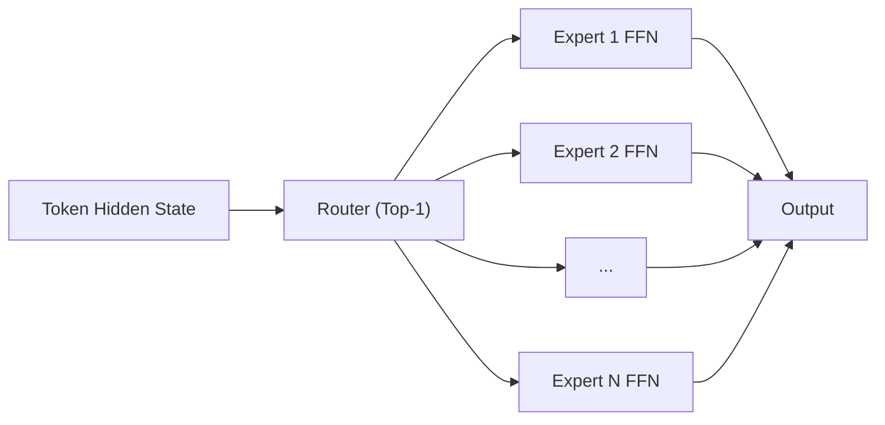

# Switch Transformers

## 3-Minute Summary

- Switch Transformer 把 MoE 结构简化为 `top-1` 路由：每个 token 只走一个专家，显著降低 MoE 通信与实现复杂度。
- 它解决的问题是：如何在不线性增加每 token 计算量的前提下，把模型参数规模大幅扩大。
- 这篇论文的重要性在于，为后续 Mixtral/DeepSeek 等 MoE 路线提供了工程可行起点。

## Problem Definition

- 输入输出:
  - token hidden states -> routed expert FFN outputs。
- 目标:
  - 提升参数容量与模型质量，同时维持可控训练/推理成本。
- 与稠密模型相比:
  - 稠密模型扩容会按参数近似线性增算力，MoE 通过稀疏激活解耦“总参数”和“每 token 成本”。

## Method

- 核心机制:
  - 使用 router 为每个 token 选择单个专家（Top-1）。
  - 每个专家是独立 FFN，最后输出回主干。

### 核心表达

```text
expert_id = argmax_i router_i(h)
h_out = Expert_expert_id(h)
```

- 训练关键:
  - 负载均衡辅助损失，避免 token 全挤向少数专家。
  - capacity factor 控制每个专家可处理 token 上限，超出部分会丢弃或重路由。

### 结构图（重绘）



## Why It Works

- 稀疏激活使参数规模扩展更便宜。
- top-1 路由简化了早期 MoE 的训练不稳定和通信复杂性。
- 在同等训练预算下，模型可获得更高表示容量。

## Experiments

- 论文在大规模预训练任务上展示了较强的质量/效率优势。
- 关键趋势:
  - 在可比计算预算下，Switch MoE 相比稠密模型有更优扩展表现。

## Implementation Notes

- 常见难点:
  - 专家负载不均。
  - all-to-all 通信瓶颈。
  - token overflow 引发有效 batch 利用率下降。
- 工程建议:
  - 监控每个专家 token 占比与丢弃率。
  - 与高效 attention kernel 联合优化，避免瓶颈转移。

## Relationship to LLM Practice

- Switch 是 “MoE 工程化起点”。
- 后续主流 MoE 模型常从 top-1 走向 top-2（如 Mixtral），在质量与开销间做新折中。

## Limitations

- top-1 容易损失表达多样性。
- 负载均衡与质量目标存在 trade-off。
- 端到端延迟不一定按理论 FLOPs 成比例下降。

## Cross-References

- 相关模型报告:
  - [Mixtral 8x7B](../../models/mistral/mixtral_8x7b.md)
  - [DeepSeek-V3](../../models/deepseek/deepseek_v3.md)
  - [DeepSeek-V2](../../models/deepseek/deepseek_v2.md)
- 相关论文:
  - [Transformer](transformer.md)
  - [GQA](gqa.md)
  - [FlashAttention](flashattention.md)
- 相关专题:
  - [MoE](../../topics/moe.md)

## References

- Primary source:
  - [Switch Transformers: Scaling to Trillion Parameter Models with Simple and Efficient Sparsity (arXiv:2101.03961)](https://arxiv.org/abs/2101.03961)
- Follow-up work:
  - [Mixtral of Experts (arXiv:2401.04088)](https://arxiv.org/abs/2401.04088)

## Review Checklist

- [x] 方法定义已核查
- [x] 关键公式没有抄错
- [x] 实验结论没有被过度解释
- [x] 已说明与主流 LLM 实践的关系
