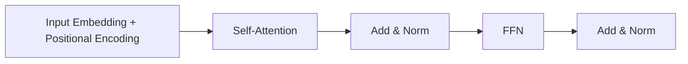

# Attention Is All You Need

## 3-Minute Summary

- 这篇论文提出 Transformer，用全注意力结构替代 RNN/CNN 主体，极大提升并行训练效率。
- 它解决了序列建模中长程依赖难、训练串行化严重的问题。
- 它的重要性在于：今天几乎所有 LLM 都建立在其核心范式之上。

## Problem Definition

- 输入输出:
  - 输入序列映射到输出序列（最初是机器翻译）。
- 优化目标:
  - 最小化序列建模损失（交叉熵）。
- 与旧方法相比:
  - 无需递归计算，训练可并行。
  - 通过自注意力直接建模长距离 token 交互。

## Method

- 核心模块:
  - Multi-Head Self-Attention
  - Position-wise FFN
  - 残差连接 + LayerNorm

### 核心公式

```text
Attention(Q,K,V) = softmax(QK^T / sqrt(d_k)) V
```

```text
MultiHead(Q,K,V) = Concat(head_1,...,head_h) W^O
```

### 结构图（按论文结构重绘）



## Why It Works

- 注意力让每个 token 可直接访问全序列信息。
- 多头机制让模型在不同子空间捕捉不同关系模式。
- 并行化显著提高吞吐，支持更大规模训练。

## Experiments

- 原论文在 WMT 机器翻译任务上取得了当时 SOTA 结果。
- 关键结论:
  - Transformer 质量更好且训练成本更优于强 RNN 基线。

## Implementation Notes

- 位置编码是无递归结构下的关键组件。
- 数值与工程细节:
  - attention mask
  - label smoothing
  - warmup 学习率策略

## Relationship to LLM Practice

- Decoder-only LLM（GPT/Llama/Qwen/Mistral）是 Transformer 家族变体。
- 后续 RoPE、FlashAttention、GQA、MoE 等都可看作对这一基座的改进。

## Limitations

- 全注意力时间/空间复杂度随序列长度二次增长。
- 超长上下文时需配合高效注意力或并行策略。

## Cross-References

- 相关模型报告:
  - [Llama 2](../../models/llama/llama2.md)
  - [Mistral 7B](../../models/mistral/mistral_7b.md)
  - [Qwen2](../../models/qwen/qwen2.md)
- 相关论文:
  - [RoFormer](roformer.md)
  - [FlashAttention](flashattention.md)
  - [Ring Attention](../long_context/ring_attention.md)
- 相关专题:
  - [Long Context](../../topics/long_context.md)
  - [MoE](../../topics/moe.md)

## References

- Primary source:
  - [Attention Is All You Need (arXiv:1706.03762)](https://arxiv.org/abs/1706.03762)
- Follow-up work:
  - [RoFormer (arXiv:2104.09864)](https://arxiv.org/abs/2104.09864)
  - [FlashAttention (arXiv:2205.14135)](https://arxiv.org/abs/2205.14135)

## Review Checklist

- [x] 方法定义已核查
- [x] 关键公式没有抄错
- [x] 实验结论没有被过度解释
- [x] 已说明与主流 LLM 实践的关系
