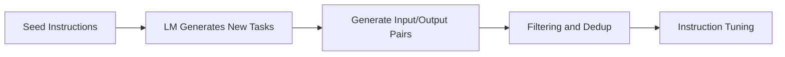

# Self-Instruct

## 3-Minute Summary

- Self-Instruct 提出一种低成本构造指令数据的方法：让强模型自举生成指令与答案，再过滤后用于微调。
- 它解决了指令数据昂贵难扩展的问题。
- 这篇论文的重要性在于：它把“合成指令数据”变成了开源社区可复制的标准流程。

## Problem Definition

- 输入:
  - 一个基础语言模型 + 少量种子任务。
- 输出:
  - 大规模、格式统一的 instruction-following 数据集。
- 目标:
  - 在尽量少人工标注成本下提升模型指令遵循能力。

## Method

- 典型流程:
  1. 准备少量人工种子指令。
  2. 让模型生成更多新指令与输入输出样本。
  3. 做去重与质量过滤。
  4. 用筛选后的数据微调模型。

### 流程图（重绘）

## Why It Works

- 任务覆盖扩展:
  - 合成流程可快速扩大任务多样性。
- 风格统一:
  - 同一 teacher 生成的数据风格一致，训练更稳定。
- 成本优势:
  - 相比全人工标注，规模扩展速度更快。

## Experiments

- 论文显示：用自举数据微调后，模型在指令遵循评测上显著优于原始基础模型。
- 关键结论:
  - 数据过滤质量决定最终上限，生成数量本身不是关键。

## Implementation Notes

- 高风险环节:
  - 近重复样本过多。
  - 任务类型偏斜。
  - 错误答案被大量引入。
- 常见工程补救:
  - embedding 去重。
  - 规则过滤 + judge 模型复审。
  - 合成数据与真实数据混训。

## Relationship to LLM Practice

- Self-Instruct 是后来许多开源指令数据流水线的起点。
- 它与 DPO/RLHF 不冲突，常作为后训练前置步骤。

## Limitations

- teacher 模型偏差会被蒸馏放大。
- 数据多样性不等于真实任务覆盖。
- 对复杂推理或高专业任务，纯自举数据可能不足。

## Cross-References

- 相关模型报告:
  - [Qwen2](../../models/qwen/qwen2.md)
  - [Llama 3](../../models/llama/llama3.md)
- 相关论文:
  - [InstructGPT](../alignment/instructgpt.md)
  - [DPO](../alignment/dpo.md)
  - [PPO](../alignment/ppo.md)
- 相关专题:
  - [Synthetic Data](../../topics/synthetic_data.md)
  - [Post-training](../../topics/post_training.md)

## References

- Primary source:
  - [Self-Instruct: Aligning Language Models with Self-Generated Instructions (arXiv:2212.10560)](https://arxiv.org/abs/2212.10560)
- Follow-up work:
  - [Orca (arXiv:2306.02707)](https://arxiv.org/abs/2306.02707)
  - [LIMA (arXiv:2305.11206)](https://arxiv.org/abs/2305.11206)

## Review Checklist

- [x] 方法定义已核查
- [x] 关键公式没有抄错
- [x] 实验结论没有被过度解释
- [x] 已说明与主流 LLM 实践的关系
