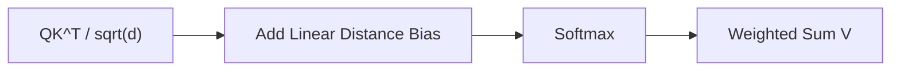

# ALiBi

## 3-Minute Summary

- ALiBi（Attention with Linear Biases）通过给注意力分数加入与距离相关的线性偏置，让模型具备更好的长度外推能力。
- 它解决的问题是：训练窗口较短时，推理到更长长度容易退化。
- 其价值在于方法简单、无需位置 embedding 表，部署改动小。

## Problem Definition

- 输入:
  - 标准 self-attention logits。
- 输出:
  - 加入距离偏置后的 attention logits。
- 目标:
  - 在较短训练长度上训练，同时在更长长度上保持性能。

## Method

- ALiBi 在每个头上引入斜率不同的线性偏置:
```text
score_{i,j} = q_i k_j / sqrt(d) + m_h * (j - i)
```
  - `m_h` 是 head-specific slope。
  - 通过偏置鼓励模型在不同头上学习不同距离模式。

### 结构图（重绘）



## Why It Works

- 线性偏置直接把相对距离信息注入注意力分数。
- 相较部分绝对位置编码，外推到更长长度时更稳定。
- 无需学习额外位置向量表，结构简单。

## Experiments

- 原论文在多种设置中展示了 train-short/test-long 的可行性。
- 关键结论:
  - ALiBi 在长度外推上通常优于固定训练窗口的绝对位置编码方案。

## Implementation Notes

- 优势:
  - 实现简单，推理时几乎无额外复杂结构。
- 注意点:
  - 斜率设计会影响头部分工和最终性能。
  - 不同任务对远距离偏置敏感度不同。

## Relationship to LLM Practice

- ALiBi 是长上下文外推早期重要基线。
- 现代 LLM 更多使用 RoPE 及其扩展，但 ALiBi 的思想仍常用于对比和启发。

## Limitations

- 对极长上下文并非万能，需要与系统优化、训练扩展配合。
- 在某些任务上可能不如 RoPE 路线灵活。

## Cross-References

- 相关模型报告:
  - [Llama 3](../../models/llama/llama3.md)
  - [Qwen2.5](../../models/qwen/qwen2_5.md)
- 相关论文:
  - [RoFormer](../architecture/roformer.md)
  - [Position Interpolation](position_interpolation.md)
  - [Ring Attention](ring_attention.md)
- 相关专题:
  - [Long Context](../../topics/long_context.md)

## References

- Primary source:
  - [Train Short, Test Long: Attention with Linear Biases Enables Input Length Extrapolation (arXiv:2108.12409)](https://arxiv.org/abs/2108.12409)
- Follow-up work:
  - [Extending Context Window via Position Interpolation (arXiv:2306.15595)](https://arxiv.org/abs/2306.15595)

## Review Checklist

- [x] 方法定义已核查
- [x] 关键公式没有抄错
- [x] 实验结论没有被过度解释
- [x] 已说明与主流 LLM 实践的关系
