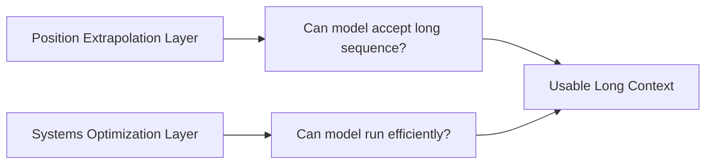

# Long Context

## Scope

这个专题关注上下文窗口扩展技术：位置编码外推、训练扩展、注意力优化和推理成本控制。

## Key Questions

- 长上下文能力来自哪里。
- 位置编码扩展与注意力优化分别解决什么问题。
- benchmark 里的上下文长度和真实可用长度差距有多大。

## Method Taxonomy

| 类别 | 代表方法 | 主要解决点 | 代价 |
|---|---|---|---|
| 位置编码外推 | RoPE scaling / PI / YaRN | 延长可用位置范围 | 远距离稳定性仍有限 |
| 注意力系统优化 | FlashAttention / Ring Attention | 内存和吞吐瓶颈 | 实现复杂、依赖硬件 |
| 训练扩展 | continued pretraining on long context | 真实长文建模能力 | 训练成本高 |

## Two-Layer Mental Model

- 只做外推不做系统优化: 能跑但很慢。
- 只做系统优化不做外推: 跑得快但长度一拉就崩。

## Practical Metrics

- 长度扩展不只看 `max_tokens`:
  - 还要看 retrieval accuracy、multi-hop consistency、长文摘要稳定性。
- 建议分层评估:
  - `needle-in-a-haystack`（检索）
  - 多文档推理（组合推断）
  - 长会话稳定性（产品实用）

## Canonical References

- RoFormer / RoPE
- Position Interpolation
- YaRN
- Ring Attention

## In-Repo Reading Order

1. [RoFormer / RoPE](../papers/architecture/roformer.md)
2. [Ring Attention](../papers/long_context/ring_attention.md)
3. [Llama 3](../models/llama/llama3.md)
4. [Qwen2.5](../models/qwen/qwen2_5.md)

## Common Pitfalls

- 把训练窗口和推理窗口混为一谈。
- 只看单一检索题型就断言“长上下文能力已解决”。
- 忽略 KV cache、并行通信和显存碎片这些系统问题。
