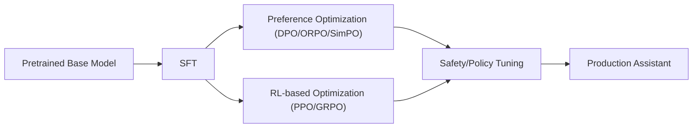

# Post-training

## Scope

这个专题关注预训练之后的能力塑形，包括 `SFT`、偏好优化、强化学习、拒答与安全行为对齐。

## Key Questions

- `SFT` 能解决什么，不能解决什么。
- `PPO`、`DPO`、`GRPO` 分别适合什么奖励形态和工程约束。
- 为什么后训练常常比预训练更直接决定“产品可用性”。

## Learning Map



## Core Concepts

- `Capability` 与 `Behavior` 分离:
  - 预训练决定能力上限，后训练塑造输出行为分布。
- KL 约束思想:
  - 许多后训练目标都可写成“提升奖励 + 控制偏移”。
```text
max_pi E[r(x,y)] - beta * KL(pi || pi_ref)
```
- 数据优先级:
  - 低噪声偏好对和高质量 SFT 数据，经常比“更复杂 loss”更重要。

## Method Comparison

| 方法 | 训练信号 | 工程成本 | 适用场景 | 主要风险 |
|---|---|---|---|---|
| SFT | 监督标签 | 低 | 快速建立指令能力 | 模仿上限受数据限制 |
| DPO | chosen/rejected 偏好对 | 中低 | 离线偏好优化 | 学进噪声和长度偏置 |
| PPO | RM 或规则奖励 | 高 | 需在线探索或复杂目标 | 成本高、训练易不稳 |
| GRPO | 组内相对奖励 | 中高 | 可验证推理任务 | 采样与奖励设计敏感 |

## Practical Checklist

- 先定义主目标:
  - `helpfulness`、`harmlessness`、`format consistency` 中哪个优先。
- 再选路线:
  - 仅离线偏好数据时，优先 `DPO`。
  - 可验证奖励充足时，再考虑 `GRPO/PPO`。
- 监控指标:
  - 不只看 win-rate，也看拒答率、长度漂移、格式稳定性和越权行为。

## Canonical References

- InstructGPT
- PPO
- DPO
- GRPO

## In-Repo Reading Order

1. [PPO](../papers/alignment/ppo.md)
2. [DPO](../papers/alignment/dpo.md)
3. [GRPO](../papers/alignment/grpo.md)
4. [Llama 3](../models/llama/llama3.md) / [Qwen2](../models/qwen/qwen2.md) / [DeepSeek-R1](../models/deepseek/deepseek_r1.md)

## Common Pitfalls

- 只看 benchmark，不看失败样本分布。
- 把 “DPO 更稳” 误解成 “DPO 总是更强”。
- 把安全对齐当发布前补丁，而不是主训练目标之一。
