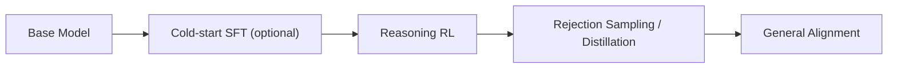

# Reasoning RL

## Scope

这个专题关注用强化学习提升推理能力的路线，重点在数学、代码和可验证任务。

## Key Questions

- 为什么 reasoning 能力提升会重新强调 RL。
- 可验证奖励如何改变训练策略。
- `PPO`、`GRPO`、`GSPO` 在 reasoning 任务中的差异是什么。

## Learning Pipeline

## Reward Design

- 规则奖励（rule-based）:
  - 数学/代码任务可直接验证正确性，稳定性高。
- 模型奖励（model-based）:
  - 适合开放任务，但更容易受偏差影响。
- 常见组合:
  - `R_total = R_correctness + lambda * R_format + mu * R_safety`

## Why Reasoning RL Works

- 推理任务常有“延迟奖励”与“长程依赖”，纯监督学习难覆盖。
- RL 能通过多次采样与比较，放大正确推理轨迹的概率质量。
- 组内相对目标（如 GRPO）可减少 value model 依赖，改善训练复杂度。

## Failure Modes

- `reward hacking`: 学会拿高分而非真正推理正确。
- 长度投机: 过长思维链提升表面分，但真实正确率不升。
- 语言混杂或格式崩坏: 可读性下降，产品体验恶化。
- 分布坍缩: 只在少数题型有效，泛化差。

## Canonical References

- DeepSeekMath
- DeepSeek-R1
- PPO
- GRPO

## In-Repo Reading Order

1. [PPO](../papers/alignment/ppo.md)
2. [GRPO](../papers/alignment/grpo.md)
3. [DeepSeek-R1](../models/deepseek/deepseek_r1.md)
4. [Post-training](post_training.md)

## Practical Checklist

- 先确认任务是否可验证，若可验证优先规则奖励。
- 同时跟踪 `pass@1`、长度分布、格式合法率、拒答率。
- RL 后必须回到通用对齐阶段，避免模型只会“做题”。
