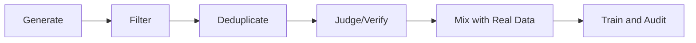

# Synthetic Data

## Scope

这个专题关注预训练与后训练中的合成数据：instruction data、distillation traces、self-play data。

## Key Questions

- 合成数据通常在补什么能力缺口。
- 什么情况下合成数据收益明显，什么情况下会“伪提升”。
- 如何做质量控制，避免把模型偏差反复放大。

## Usage by Stage

| 阶段 | 典型用途 | 风险 |
|---|---|---|
| Pretraining | 补稀缺领域文本（代码/数学） | 分布偏移与风格单一 |
| SFT | 生成 instruction-following 样本 | 模板化回答、过拟合提示词 |
| RL/Preference | 生成候选答案与偏好对 | 奖励偏差被放大 |
| Distillation | 蒸馏强模型推理轨迹 | 复制 teacher 的系统性错误 |

## Quality Control Framework

- `Generate`: 多提示词、多温度，避免模式塌缩。
- `Filter`: 去除低质量、幻觉和不安全内容。
- `Judge/Verify`: 可验证任务优先规则校验，不可验证任务再用模型评审。
- `Mix`: 合成数据不能全量替代真实数据，必须混合。

## Canonical References

- Self-Instruct
- Orca
- Textbooks Are All You Need

## In-Repo Reading Order

1. [Qwen2](../models/qwen/qwen2.md)
2. [Llama 3](../models/llama/llama3.md)
3. [DeepSeek-R1](../models/deepseek/deepseek_r1.md)
4. [Post-training](post_training.md)

## Practical Checklist

- 区分“可验证任务”和“不可验证任务”的数据构造策略。
- 跟踪合成数据占比，不要让训练分布被单一来源主导。
- 建立小规模人工抽检闭环，优先查错误类型分布而非平均分。
